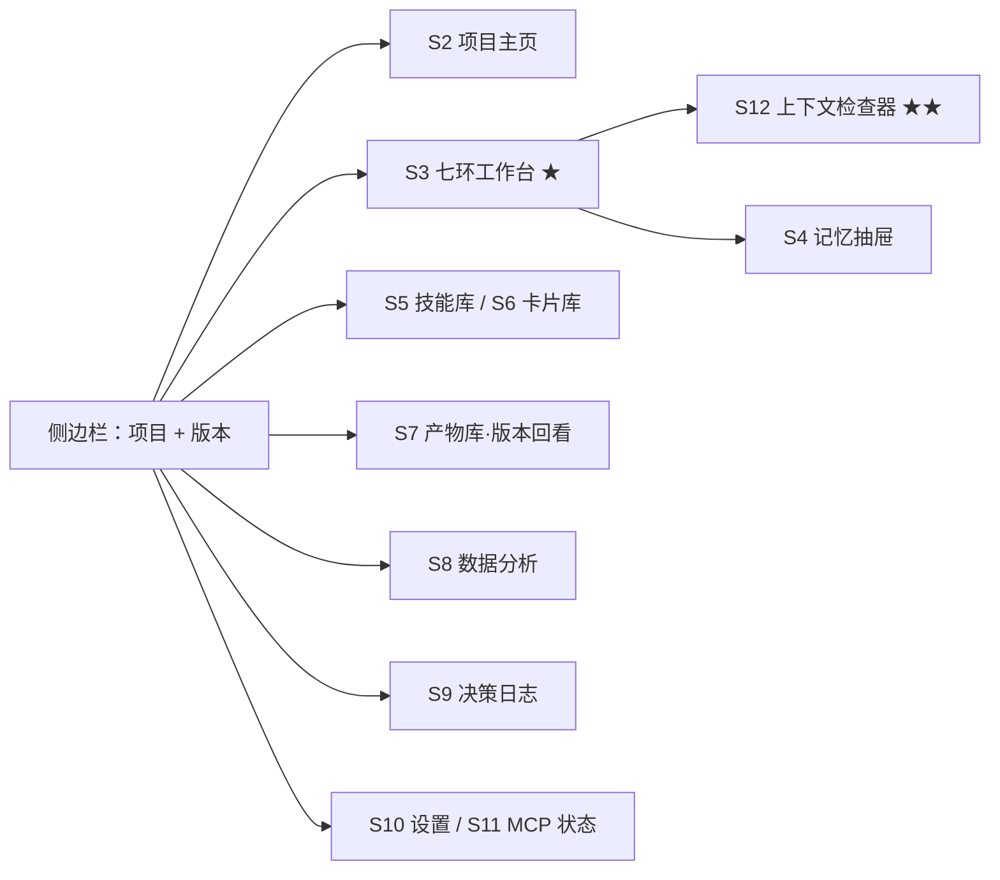

# PM Agent · 简化版需求文档 v0.1（施工用）

<aside>
⚠️

**这份文档的定位**：不是第二份方案页，是**照着敲代码的施工清单**。方案、决策 WHY、风险、里程碑全在母页，本页**不重复**。

它消耗的是门禁 1（纸面封顶）的**唯一一次例外**。M0 跑通前，不得再新建任何设计页。本页若超过一屏半，就是又在写方案。

</aside>

## 1. 一句话定义

一个**本地优先的 macOS 应用**，帮单人产品经理把一个想法走到上线后复盘，并在这个过程中**自动沉淀出可复用的知识卡片与决策记录**。

- **用户**：chen 本人（干中学）+ 面试官（评估）。其他都是想象用户，不为他们做决策。
- **单机单用户**，无账号、无服务端、无多租户。

**七环是哪七环**（全文 ①～⑦ 均指此表）

| 环 | 干什么 | 产出物 | 深度 | F |
| --- | --- | --- | --- | --- |
| **① 想法提出** | 模糊念头 → 可被否证的问题 | 目标收敛句 + 3 假设 + 1 关键问题 | 做深 | F2 |
| **② 需求分析** | 拆解、定优先级、划边界 | 需求清单 + 做/不做边界 | 做深 | F3 |
| **③ 方案决策** | 多方案对比，选一个并说清为何不选其他 | 决策 + WHY + 排除方案 + 置信度 | 做深 | F22 |
| **④ 执行产出** | 把方案变成可交付文档 | PRD + 5-10 条 eval | 做深 | F12 |
| **⑤ 数据分析** | 上线后数据 → 结论 | 数据报告（数字可复算） | 跑通即可 | F11 |
| **⑥ 迭代管理** | 基于结论开下一版 | 新版本（继承约束，不继承讨论） | 跑通即可 | F14 |
| **⑦ 复盘** | 上一版哪错了、为何错 | 根因 + 规则变更建议（回写技能层） | 做深 | F17 |

**不是线性流程**：⑤⑥⑦ 经常回跳到 ① 或 ③（数据推翻假设、复盘推翻方案）。这是 S3 不做 wizard 的原因。

---

## 2. MVP 范围（一张表看完）

| 做 | 不做 |
| --- | --- |
| 七环主链（①②③④⑦ 做深，⑤⑥ 跑通即可） | 设计对齐、跨部门推动、埋点/BI 接入 |
| 三横切层：记忆 / 知识 / 技能 | 多用户、鉴权、云同步 |
| 容器层：项目 / 版本 / 产物 | 多人协作与版本合并 |
| MCP server（stdio）对外暴露 | Web 版 / 可分享链接 |
| 原型**归档**（截图 / 链接 / HTML 文件） | 原型的 **AI 生成**（待确认，见第 7 节） |
| CSV 手动上传 + 代码计算 | 模型心算数字 |

---

## 3. 功能需求清单

每条格式：**能干什么 → 怎么算做完了**。验收列直接对应母页的 eval 编号。

### P0 — 不做就不成立

| # | 功能 | 验收标准 | Eval | 里程碑 |
| --- | --- | --- | --- | --- |
| F1 | 新建项目，生成真实文件夹 | Finder 里能打开 `Projects/项目名/v0.1/` | — | W1 |
| F2 | ① 环：模糊念头 → 目标收敛句 + 3 假设 + 1 关键问题 | 4 个【】全填；关键问题的两个答案导向不同方案 | E1 | W1 |
| F3 | ② 环：需求拆解与清单输出 | 第二轮**不需要复述**第一轮结论 | E9 | W1 |
| F22 | ③ 环：方案对比 → 决策写入 `decisions.jsonl` | 5 字段齐全；**至少 2 个被排除方案带理由**；否决项自动入记忆层 | E9 | W2 |
| F4 | 记忆层：结论/约束/否决项自动写入，跨环注入 | 新结论**覆盖**旧结论，不并存 | E9 | W1 |
| F5 | 技能层：元数据常驻 + 命中后加载正文 | 未命中 skill 的正文**不出现**在上下文（token 可测） | E11 | W2 |
| F6 | 技能层双模式：「学」与「调」 | 同一份正文，两条读取路径都能跑 | — | W2 |
| F7 | 知识层：「这条记下来」→ 卡片入库 | 4 字段齐全；同概念第二次**合并而非新建** | E10 | W3 |
| F8 | RAG：历史文档检索并标来源 | Top3 命中率 ≥ 70%（30 条标注） | E2 | W3 |
| F9 | 规范路由：PRD 模板走确定性检索 | 100% 命中当前版，0 次召回历史版 | E3 | W3 |
| F10 | 工具调用 + write-then-verify | 写入后必有一次回读校验，不一致则报错 | E4 E5 | W4 |
| F11 | ⑤ 环：CSV 上传 → 代码计算 → 报告 | 数字可独立复算，误差 0；结论与数字分离标注 | E12 | W4 |
| F12 | ④ 环：PRD + 5-10 条 eval 自动生成 | 每条 4 要素齐全 | E6 | W5 |
| F13 | 七环编排 + 状态持久化 | 退出 App 再打开，恢复到中断前 | E8 | W5 |
| F14 | ⑥ 环：开新版本（继承约束，不继承讨论） | 新版本自动带上上版的约束与否决项 | — | W5 |
| F15 | 封版快照与版本回看 | 与封版快照**逐字一致** | E14 | W5 |
| F16 | 作用域隔离：检索层强制 scope 过滤 | 切到项目 B，检索结果中 **0 条**来自项目 A | E13 | W5 |
| F17 | ⑦ 环：复盘 → 根因 + 规则变更建议 | 输出能回写技能层或规则库 | — | W5 |
| F18 | MCP server（stdio）暴露 PRD/Eval 生成 | Claude Desktop 能发现并成功调用 | E7 | W6 |

### P1 — 有时间就做

| # | 功能 | 备注 |
| --- | --- | --- |
| F19 | 产物归档：拖入截图 / HTML / 链接到当前版本 | 实现成本低，但不阻断任何 eval |
| F20 | 决策日志 UI（append-only 列表） | 底层数据是 P0，界面是 P1 |
| F21 | 模型路由：小模型做意图分类 | 降本考点，也是单位经济学素材 |

---

## 3.5 界面清单与功能点

**形态**：单窗口三栏（`NavigationSplitView`）。左栏导航、中栏工作区、右栏 Inspector。**不做多窗口、不做自绘控件。**



| 界面 | 功能点 | 对应 F | 里程碑 |
| --- | --- | --- | --- |
| **S1 侧边栏** | 新建项目（输名字 → 生成文件夹）・项目切换（**切换即切 scope**）・版本下拉切换・已封版徒标・右键「在 Finder 中显示」 | F1 F14 F16 | W1 |
| **S2 项目主页** | 目标收敛句卡片（可编辑）・长期约束列表・**否决项列表（红色）**・版本时间线・七环状态点 | F1 F14 | W1 骨架 |
| **S3 七环工作台 ★** | 左：环切换器（未开始/进行中/已完成，**允许回跳**）・中：对话流（流式吐字、工具调用可折叠、**skill 命中徐章**）・右：本环结构化产出面板（可编辑 → 另存为 artifact）・底：输入框 + **「这条记下来」按钮**  • 附件拖入 | F2 F3 F5 F7 F10 F12 F13 F17 F19 | W1 起 |
| **S4 记忆抽屉** | 当前注入的记忆列表（**按 scope 分组着色**）・已失效记忆折叠・手动删除/置顶・点「被谁覆盖」跳转 | F4 | W1 |
| **S5 技能库 ★** | 列表（name + when_to_use + tags）・搜索・正文预览・**两个按钮：「学这个」/「用这个」**・命中历史计数 | F5 F6 | W2 |
| **S6 卡片库** | 列表 + 概念名搜索・**相似卡片合并弹窗**（新建时触发）・来源跳转・关联卡片链接 | F7 F8 | W3 |
| **S7 产物库·版本回看 ★** | 产物按类型分组・**切到已封版版本后全界面只读 + 顶部黄条提示**・同名产物并排 diff（v1.0 vs v1.1）・「封版」按钮（手动触发） | F15 F14 F19 | W5 |
| **S8 数据分析** | CSV 拖入区・字段预览表・生成报告・**报告里每个数字可点开看计算代码**・结论区强制标注不确定性 | F11 | W4 |
| **S9 决策日志** | 时间线（**不可删除**）・每条 5 字段・按版本筛选・**「待验证」未闭环高亮** | F20 | W5 |
| **S10 设置** | API key（Keychain）・模型选择・ token 上限・**成本统计（本次/本月）**・数据目录位置 + 「重建索引」 | F21 | W1 最简 |
| **S11 MCP 状态** | server 开关・传输方式 stdio・已暴露 tool 列表・最近调用日志・**「复制 Claude Desktop 配置」按钮** | F18 | W6 |
| **S12 上下文检查器 ★★** | 本次请求的 **token 构成条**（规则/记忆/skill 正文/检索/历史）・**检索 trace**：query → 命中条目 + **scope 标签**  • 相似度・**未命中 skill 列表**（证明没被注入） | F5 F8 F9 F16 | W2 起 |

<aside>
🎯

**S12 是面试演示的胜负手，优先级应该高于它看起来的样子。**

因为 E11（未命中 skill 正文不入上下文）和 E13（跨项目 0 条泄漏）**本质上都是「某东西没发生」**——没有检查器，你只能口头声称；有了它，你能当场指着屏幕说「看，30 条 skill 里只有这 1 条的正文进了上下文」。**绝大多数 demo 没有这个面板，这是最低成本的差异化。**

</aside>

**三条 UI 层决策**

1. **七环不做强制向导（wizard）**。⑤⑥⑦ 环会回跳到 ①③，wizard 会把回跳做成「重来」。改用**环切换器 + 状态点**：顺序是默认建议，不是硬约束。
2. **只用系统原生控件**（`List` / `Table` / `Inspector` / `NavigationSplitView`），不自绘。白拿暗黑模式、动态字体、键盘操作；**自绘 UI 会吃掉本该花在 Agent 上的时间**。
3. **每个 AI 输出必须有来源入口**：卡片能跳回出处、数字能点开代码、检索结果能点开原文。这不是体验优化，是六视角里「信任」的唯一实现方式。

**界面排期**：W1 = S1+S2骨架+S3（中栏与底部）+S4+S10最简 → W2 = S5+S12 第一版 → W3 = S6 → W4 = S8 → W5 = S7+S9+S3 右栏完整 → W6 = S11 + 打磨。

### 交互原型（可点击）+ 12 屏线框图

[pmagent-prototype.html](PM%20Agent%20%C2%B7%20%E7%AE%80%E5%8C%96%E7%89%88%E9%9C%80%E6%B1%82%E6%96%87%E6%A1%A3%20v0%201%EF%BC%88%E6%96%BD%E5%B7%A5%E7%94%A8%EF%BC%89/pmagent-prototype.html)

<aside>
🖱️

**可点的关键路径**（顶部两个 tab 切「交互原型」/「线框图总览」）：

- 左栏切 **WidgetToDo ↔ Repaste** → 右栏记忆与检索范围同步变化（F16 / E13）
- 七环切换器任意跳转 → 七个环的真实产出结构各不相同
- 右栏切到 **S12 上下文检查器** → token 构成条 + 检索 trace + 「已过滤 41 条」+ 未命中 skill 列表
- 点对话里的**工具调用条** → 跳转到 S5 或 S12（可解释性入口）
- 点**「这条记下来」** → 相似卡片合并弹窗（E10）
- 版本下拉切到 **v1.0 🔒** → 全界面只读 + 顶部黄条；S7 里看并排 diff（E14）
- S8 报告里点**任意数字** → 弹出计算代码（E12）
</aside>

---

## 4. 数据模型（W1 必须定死，后期改不动）

**目录结构**

```
~/PMAgent/
  skills/              全局，不属于任何项目
    <skill名>.md       front-matter: name / when_to_use / tags
  cards/               全局知识卡片
  index.sqlite         索引（可丢弃重建）
  Projects/
    <项目名>/
      project.json     目标收敛句、长期约束、否决项
      v0.1/
        artifacts/     PRD、原型、报告、复盘（封版后不可变）
        discussions.jsonl   append-only
        decisions.jsonl     append-only
        version.json   状态、继承自、封版时间
      v1.0/
```

<aside>
🔑

**唯一真相源 = 文件系统**。`index.sqlite` 只是加速索引，**必须能随时删掉并从文件全量重建**。用户在 Finder 里手改文件是合法行为，不是异常。这条定下来，双写一致性问题就不存在了。

</aside>

**核心实体**

| 实体 | 关键字段 | 特性 |
| --- | --- | --- |
| Project | id、name、目标收敛句、约束[]、否决项[]、当前版本 | 可变 |
| Version | id、projectId、版本号、状态（草稿/已封版）、继承自、封版时间 | 封版后只读 |
| Artifact | id、versionId、类型、标题、文件路径、来源（AI/上传/对话） | 封版后不可变 |
| Decision | id、versionId、决策、WHY、排除方案、置信度、待验证 | **append-only** |
| Memory | id、**scope（global/project/version）**、scopeId、类型、内容、是否失效、被谁覆盖 | 覆盖而非删除 |
| Card | id、概念名、出处、我的话复述、关联卡片[]、projectId（空=全局） | 去重合并 |
| Skill | id、name、**when_to_use**、正文路径、tags[] | 全局，跨项目共享 |

**作用域优先级**：版本级 > 项目级 > 全局。冲突时**窄的赢**。**只有 skills/ 和全局 cards/ 可以跨项目被检索到，其余一律不行。**

---

## 5. 非功能需求

| 项 | 要求 |
| --- | --- |
| 平台 | macOS 14+，Apple Silicon 优先 |
| 响应 | 首 token < 3s；检索 < 200ms（内存余弦） |
| 离线 | 除模型调用与联网搜索外，全部功能可离线 |
| 安全 | API key 存 Keychain；不进 git；无遥测 |
| 成本 | 单次全流程调用设 token 上限并记录实际花费 |
| 可观测 | **每次检索打出 scope 与命中来源**，否则 E13 无法验证 |

---

## 6. 验收线

**M0（W1 末）不通过则全案作废**：F1 + F2 + F3 + F4 全部可演示。

**最终交付（W6 末）**：一个双击能跑的 `.app` + 3 分钟录屏 + 5 分钟演示脚本 + 14 条 eval 全绿。

---

## 7. 待确认（阻塞项已标红）

| # | 问题 | 影响 | 截止 |
| --- | --- | --- | --- |
| Q1 | 🔴 「原型」是 AI 生成还是归档？ | 生成 = +3~5 天，必须从别处砍等量 | 现在 |
| Q2 | 🔴 技能层初始内容边界（哪些 AI 产品 / 方法论） | 阻塞 F5/F6 | W2 前 |
| Q3 | 面试时间线 | 决定 6 周版还是 3 周版 | 现在 |
| Q4 | Swift 并发（actor / async）熟练度 | 直接决定 F13 的工量 | 现在 |
| Q5 | 是否花 $99 办 Apple Developer 公证 | 决定交付形态（见母页 R9） | W4 前 |