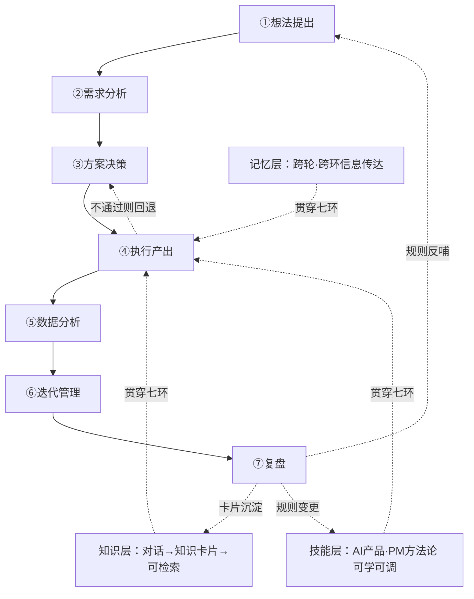
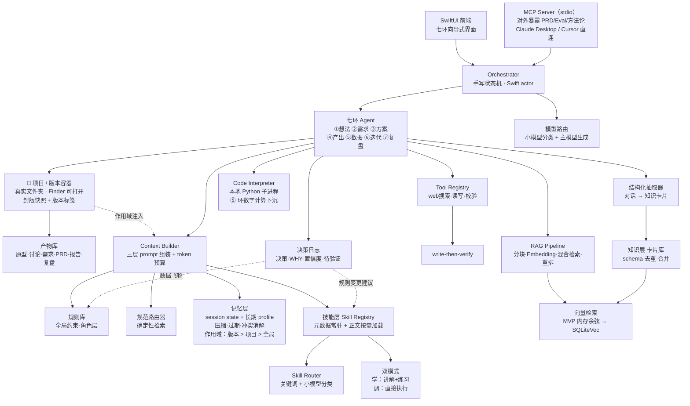

# PM 全流程 AI Agent（独立产品）· 技术方案与干中学路径 v1.0（2026-09-08）

<aside>
🎯

**目标收敛句**：本产品服务于【需要独立走完产品全生命周期的产品经理】，解决其在【从一个想法走到上线后复盘的七个环节】中【每一环都要重新组织思路、跨环信息断裂、方法论散落各处无法即时调用】的阻塞，目标是让用户完成【一次从想法到复盘的端到端闭环，并沉淀出可复用的知识卡片与决策记录】。

**对 chen 的第二目标（同等重要）**：通过亲手实现，把 Prompt / RAG / Tool Calling / MCP / Workflow / Memory / 结构化抽取 / Skill 系统 / 作用域化状态管理 九项从「读过」变成「做过并能讲清取舍」。

</aside>

<aside>
🔒

**本方案锁定的假设**（你未确认，若不符请告知，方案会变）

1. **周期 6 周**，每周可投入 10-15 小时（约 60-90 小时总量）
2. **技术栈走 macOS 原生（Swift / SwiftUI）**，本地优先，不做 Web 部署（🔄 2026-09-09 由 TypeScript 改判，见决策 2）
3. **面试用途优先级 > 商业化优先级**：MVP 只需**能在你自己电脑上现场演示 + 一段可转发的录屏**，不需要公开分发、付费与增长

若周期少于 3 周 → 只做 ①②④ 环 + 技能层 + MCP，其余按第八节深度分级砍；若你想认真做商业化 → 需要另做一份市场验证，本方案不覆盖。

</aside>

## 一、第一性原理三步

**① 核心假设**

- 全流程（七环）+ 十项技术全覆盖，是证明能力的正确形态
- 角色指令与迭代日志搬过去即可复用
- 没有 Notion 的 PM 会因此选择这个产品
- 记忆传达、知识提炼、技能库这三项是七环之外的「附加功能」

**② 逐一质疑**

- 假设 1 **成立，但成立的理由和你说的不同**。它成立不是因为「覆盖面 = 能力」，而是因为**这十项技术在七环与三层里各有真实必要性**（见第三节）。区别很关键：前者面试会被打穿，后者是加分。所以本方案的任务不是砍范围，是**为每一项补上必要性论证**。
- 假设 2 **部分不成立**。角色指令是纯文本，搬过去零成本。但**迭代日志的价值不在内容，在结构**——它是 20 次「规则变更 + WHY + 置信度 + 待验证」的记录，直接搬只是语料；要发挥价值，必须把它做成产品内的**决策日志数据结构**，让用户的每次决策自动产生同构记录。这才是产品级复用。
- 假设 3 **不成立**。「没有 Notion」不是需求，只是一个否定条件。这些人的真实替代品是 ChatGPT / Claude / 飞书 + 通用 AI。**这条对面试完全无影响**（面试官不看 PMF），只在你想长期做时才需要重解。本方案按面试优先处理，不在此展开。
- 假设 4 **完全不成立，而且反了**。记忆层、知识层、技能层**不是附加功能，是三个横切基座**。缺记忆层，七环会退化成七个互不相干的聊天窗口；缺技能层，方法论无法规模化装进上下文；缺知识层，产品用得越久越不值钱。**而这三项恰好是你资产最厚、别人最难复制的部分**——所以它们优先级高于 ⑤⑥ 两环，见第八节深度分级。

**防锚定检验**：「五项技术要不要全做」这个问题，只在这个产品上存在吗？不是——你未来任何 AI 项目都会遇到「学习覆盖 vs 交付聚焦」的张力。所以本方案的解法必须是**结构性的**：用「每项技术各占一个必要环节或横切层」的架构同时满足两者，而不是二选一。

**③ 重新推导**

把「全流程」定义为 **七个环节 + 三个横切层**，让每项技术**各自落在最需要它的那一环或那一层**。这样覆盖面来自架构的自然结果，而不是硬塞——**这就是「不臃肿」的技术论证，也是你在面试里要讲的那句话。**

---

## 二、产品定义：七环 + 三层

**七环主链**

| 环 | 输入 | 输出 | 主导技术 |
| --- | --- | --- | --- |
| ① 想法提出 | 一句模糊念头 | 目标收敛句 + 3 个隐性假设 + 1 个关键问题 | Prompt 分层 / 上下文工程 |
| ② 需求分析 | 收敛后的问题 | 用户与场景拆解、竞品事实、需求清单 | **RAG + Tool Calling** |
| ③ 方案决策 | 需求清单 | 2-3 个方案对比 + 决策 WHY 五项 | Workflow + Skill 调用 |
| ④ 执行产出 | 选定方案 | PRD + 5-10 条 Eval + 漏项雷达 | Prompt + Eval 设计 |
| ⑤ 数据分析 | 上线后数据（手动上传） | 数据报告 + 归因 + 下一步建议 | **Code Interpreter**（计算下沉） |
| ⑥ 迭代管理 | 报告 + 反馈 | 迭代清单 + 优先级 + 版本记录 | 结构化抽取 + 状态持久化 |
| ⑦ 复盘 | 一个版本的完整记录 | 根因分析 + 规则变更建议 | **Memory + 数据飞轮** |

**三个横切层（你这次新提的三项，全部是 P0）**

| 层 | 解决什么 | 主导技术 | 你的现成资产 |
| --- | --- | --- | --- |
| 🧠 记忆层 | 每轮对话的重要信息被自动提取、压缩、跨环传递，用户不必复述 | Memory / 上下文压缩 | 迭代日志的「待验证」字段结构 |
| 📇 知识层 | 对话中的关键信息一键提炼成知识卡片，写回知识库并可被检索 | 结构化抽取 + RAG 写入闭环 | 永久笔记卡片生成教练 |
| 🎓 技能层 | AI 产品能力与 PM 方法论作为 skill 入库，既能「学」也能「调」 | Skill 渐进式披露 | 10 个角色指令 + 8 篇产品复盘 + 方法论笔记 |

**容器层：工作区 → 项目 → 版本 → 产物**（🆕 2026-09-09 补入）

| 层级 | 是什么 | 承载内容 | 关键约束 |
| --- | --- | --- | --- |
| 工作区 | 你的全部产品 | 多个项目并行 | 跨项目共享的**只有**技能层与方法论 |
| 项目 | 一个产品 = **一个真实文件夹** | 目标收敛句、长期约束、否决项、全部版本 | 项目级记忆**不得跨项目泄漏** |
| 版本 | v0.1 / v1.0 / v1.1 | 该版本的需求、方案、原型、讨论、PRD、eval、数据报告、复盘 | 已封版的产物**不可变** |
| 产物 | 单个文件或记录 | 原型 / 讨论 / 需求 / PRD / 报告 / 复盘 | 每个产物必须带**版本标签 + 来源** |

**这不是第八个环节，是七环的容器。** 七环每跑一次，产出物落进「当前项目 / 当前版本」；**⑥ 迭代管理环的动作就是开一个新版本**，**⑦ 复盘环的对象就是上一个版本的完整记录**。

**它补上了原方案的一个真实漏洞**：原方案从头到尾没有回答两个问题——「七环的产出物存在哪里」「多个产品并行时记忆层怎么隔离」。加上容器层后，⑥ 环从一句空话变成有实体的东西，记忆层也第一次有了明确的作用域边界。**所以这一条不是范围蔓延，是补漏。**

**你列了 9 件事，为什么落成七环 + 三层**

- 「想法提出」与「需求分析」**不能合并**：前者是发散求可能性，后者是收敛求确定性，两个动作的 prompt 目标相反，合并会互相污染。
- 「运行的输出」归入 ④ 执行产出，与 Eval 生成同环——**产物和验收标准必须同时生成**，否则又是无验收的交付。
- 「对话重要信息的传达」不是一个环，是**贯穿层**。它如果做成环，用户就得手动搬信息，那还不如不做。
- 「提炼知识点」同理，是**写入型能力**，挂在每一环上。
- 「引入 AI 产品与方法论作为技能」是**技能层**，且必须同时支持两条读取路径：**「学」模式**（讲给我听、出练习题）与**「调」模式**（直接用这个方法论处理我当前的问题）。这个双模式是你这个产品最独特的一点，见决策 7。

**刻意排除**：设计对齐、跨部门推动、自动接入埋点/BI —— 强依赖组织协作与外部系统权限，产品做不了，做了也是空转。见第十二节。

---

## 三、干中学映射表 ★核心

> 这张表是本方案的价值所在。每一行回答三件事：**这项技术在产品里为什么必需**（不是硬塞）、**你要做的真实技术决策是什么**（面试考的就是这个）、**对应哪道面试题**。
> 
> 
> 共 11 项。其中 **3.7 记忆层 / 3.8 知识层 / 3.9 技能层 / 3.11 容器层** 来自你的补充，也是全表中**最难被其他候选人复制**的几项——因为它们要的是你已经积累了两年的资产，不是几天能补的代码。
> 

### 3.1 Prompt / 上下文工程 → 全环基座

| 项 | 内容 |
| --- | --- |
| **必要性** | 你有 10 个角色指令 + 20 万字笔记。上下文窗口装不下，**必须做取舍与分层**。这个约束是真的，不是设计出来的 |
| **你要做的决策** | ① system prompt 三层拆分（全局约束 / 角色 / 场景）② 上下文预算分配（规则占多少、检索占多少、历史占多少）③ 规则按需注入 vs 全量注入 ④ 用户输入的注入防护 |
| **吃到的知识点** | Token 与窗口的产品后果、指令优先级冲突、上下文预算、prompt injection |
| **对应面试题** | 「模型总是答偏，你从哪几层排查？」→ Prompt → 上下文 → 检索 → 模型能力 |

### 3.2 RAG → ② 需求分析环 + 知识层

| 项 | 内容 |
| --- | --- |
| **必要性** | 用户的历史文档 + 你的笔记库要能被检索；且知识层每天产出新卡片写回向量库，**这是一个读写双向的 RAG，不是只读 demo** |
| **你要做的决策** | ① 分块策略：按章节语义分 vs 固定 512 token 窗口 ② embedding 选型与成本 ③ 混合检索（BM25 + 向量）要不要 ④ rerank 要不要 ⑤ **哪些内容不走 RAG**——PRD 模板这类规范文档必须走确定性路由，因为向量检索会召回过期版本，而**过期规范比没有规范更危险** |
| **吃到的知识点** | 7 环链路（清洗→分块→Embedding→检索→重排→组装→生成）、权限过滤必须在检索层、何时不该用 RAG |
| **对应面试题** | 「实时价格能不能进 RAG？」（不能，走 API）「你的检索怎么切片和排序？」 |
| **⚠️ 关键提醒** | 决策 ⑤ 是你**已经做过**的决策（产品之神 M40/M41 的 loadPage 前置加载律就是它）。这次是把它从「凭直觉」升级为「有对照实验」。**做一次 A/B：同一份规范文档，向量检索 vs 确定性路由，量出召回到过期版本的比例。** 这个数字是你整个面试里最硬的一块证据 |

### 3.3 Tool Calling → ②③④⑤ 环

| 项 | 内容 |
| --- | --- |
| **必要性** | 竞品检索要联网、PRD 要写文件、eval 要能跑。必须有工具 |
| **你要做的决策** | ① 工具描述怎么写才让模型选对（同一功能不同描述，选择准确率差异很大）② 参数校验放模型侧还是代码侧 ③ 超时与重试策略 ④ **write-then-verify**：写入后必须回读确认，防「返回成功但语义未生效」 ⑤ 工具数量上限——超过多少个后选择准确率开始下降 |
| **吃到的知识点** | Function Calling 机制、工具选择失败模式、幂等设计、失败兜底 |
| **对应面试题** | 「工具调用返回成功但实际没生效，你怎么发现和兜底？」 |
| **⚠️ 关键提醒** | 你有第一手事故：产品之神 v3.12 记录的 `oldStr: ""` 导致 updatePage 假成功。**把这次事故写进产品的兜底设计，并在面试里讲这个故事**——真实踩坑的说服力远高于背概念 |

### 3.4 MCP → 对外接口层

| 项 | 内容 |
| --- | --- |
| **必要性** | 你自己说的：不是所有人都用你的 UI。**把 PRD 生成、Eval 生成暴露为 MCP tool，别人在 Cursor / Claude Desktop 里就能直接调用你的产品。** 这是 MCP 存在的唯一合理理由，也让「别人为什么用你」有了真答案——不是因为他们没 Notion，是因为他们能在自己的工具里调用你的能力 |
| **你要做的决策** | ① 暴露哪些能力为 tool、哪些为 resource、哪些为 prompt（MCP 三原语）② **传输层选 stdio 还是 HTTP**——本地 Mac App 走 stdio 是最原生的形态 ③ MCP server 与直接开 HTTP API 的抽象层差异 ④ 鉴权怎么做（本地 stdio 下这题变简单，但你要能说清「为什么变简单」）⑤ 同时做 client 接外部 MCP（如 GitHub / 文件系统） |
| **吃到的知识点** | MCP 三原语、MCP 与 Function Calling 的抽象层区别（协议层 vs 调用层）、server/client 双向角色 |
| **对应面试题** | 「MCP 和 Function Calling 是一回事吗？」→ 不是。Function Calling 是模型与单个应用的调用约定；MCP 是应用与工具提供方之间的**标准协议**，解决的是 N×M 集成爆炸 |
| **🖥 Mac 端加成** | 改判 Mac 后这一节变强了：**本地 App + stdio 是 MCP 设计时的默认形态**。别人只需在 Claude Desktop 配置里指向你的可执行文件。演示时「你的 App 在后台当 server，Claude Desktop 在前台调用它」这一幕，比任何口头解释都有说服力 |

### 3.5 Workflow → 七环编排

| 项 | 内容 |
| --- | --- |
| **必要性** | 七环有确定性先后顺序（不能先写 PRD 再分析需求），但每环内部需要自主决策；而 ⑤⑥⑦ 环还可能**回跳**到 ①③ 环。这正是 Workflow 与 Agent 的分界现场 |
| **你要做的决策** | ① 逐环判定用 Workflow 还是 Agent，并写下理由 ② HITL 门禁放在哪一环（建议 ①→② 与 ④→⑤ 之间）③ 状态持久化：中断后能否恢复 ④ 失败重试与回退路径 ⑤ **手写状态机，不用 LangGraph**——见决策 3 |
| **吃到的知识点** | Workflow vs Agent 判据、状态机设计、人在环、失败恢复 |
| **对应面试题** | 「这个场景用 Workflow 还是 Agent？」→ 确定性走 Workflow。**你能拿出一张逐环标注的架构图，这比任何口头回答都强** |

### 3.6 Eval → ④ 环（2026 头号信号）

产品的 ④ 环本身就是一个 eval 生成器。做完这个产品，你同时拥有：**一套自己定义的评测集 + 一个能生成 eval 的产品**。对照你自己的 rubric，Eval 设计力可从 L2 直接推到 L3-L4。[[1]](https://app.notion.com/p/AI-v1-0-2026-09-04-1fbf1b5a6b3247ea9fb9af4158facc77?pvs=21)

### 3.7 Memory / 上下文压缩 → 🧠 记忆层

| 项 | 内容 |
| --- | --- |
| **必要性** | 七环跨越多次会话、多天。用户不可能每次复述前面的结论。你说的「每轮对话所涉及到的重要信息的传达」**就是记忆层**——它不是可选优化，缺了它七环会退化成七个互不相干的聊天窗口 |
| **你要做的决策** | ① **写入判据**：什么信息值得进记忆（结论、约束、否决项进；寒暄与中间推理不进）② 短期 session state 与长期 profile 分离 ③ 压缩策略：滚动摘要 vs 分层摘要 vs 原文保留关键片段 ④ **记忆冲突与过期**：新结论覆盖旧结论的规则 ⑤ 注入位置与 token 预算 |
| **吃到的知识点** | 短期/长期记忆分层、上下文压缩、记忆写入门槛、记忆冲突消解、记忆污染 |
| **对应面试题** | 「上下文超长怎么办？」→ 不是换更大窗口，而是**分层记忆 + 压缩 + 按需检索**三件事组合 |
| **⚠️ 关键提醒** | 你已有真实素材：产品之神的「待验证」字段就是一种人肉长期记忆。而你在 M40/M41 上的判断——**「过期记忆比没记忆更危险」**——在这里第二次生效。**务必做一条 eval 专测记忆过期**（E9），这是绝大多数 demo 的裸奔处 |

### 3.8 结构化抽取 → 📇 知识层

| 项 | 内容 |
| --- | --- |
| **必要性** | 你要的「关键信息提炼成知识点」**不是自由生成，是 schema 约束下的抽取**。自由生成的卡片无法去重、无法检索、无法累积 |
| **你要做的决策** | ① 卡片 schema（一卡一概念 / 出处 / 用自己的话复述 / 关联卡片）② 结构化输出约束 vs 自由文本再解析 ③ **触发方式**：用户手动点「记下来」vs AI 主动建议（准确率与打扰的权衡）④ **去重与合并**：同一概念第二次出现怎么办 ⑤ 卡片写回向量库，闭环生效 |
| **吃到的知识点** | 结构化输出约束、schema 设计、抽取任务的精确率/召回率取舍、**写入型 RAG**、知识库劣化 |
| **对应面试题** | 「怎么让模型输出稳定可解析的结构？」+「知识库怎么持续增长而不劣化？」 |
| **⚠️ 关键提醒** | **去重是最容易被忽略、也最能体现工程深度的一环**。没有去重的知识库三个月后就是垃圾场。面试时主动讲去重策略，能立刻区分「做过」和「跑过 demo」 |

### 3.9 Skill 系统（渐进式披露）→ 🎓 技能层 ★最值钱

| 项 | 内容 |
| --- | --- |
| **必要性** | 你要引入「各种 AI 产品与 PM 方法论作为技能」。方法论会长到几十上百条，**全量注入上下文物理上不可能**。必须只让名称与适用描述常驻，命中后再加载正文。这就是渐进式披露，是 2026 Agent 架构的核心机制之一 |
| **你要做的决策** | ① skill 元数据设计（name / when_to_use / 正文）② 路由方式：关键词确定性命中 vs 向量语义匹配 vs 小模型分类 ③ **Skill 与 Tool 的边界**：skill 是给模型看的知识与流程，tool 是产生副作用的函数 ④ **「学」与「调」双模式共用同一份正文的两条读取路径**（见决策 7）⑤ skill 数量膨胀后的描述冲突与命中率下降 |
| **吃到的知识点** | 渐进式披露、metadata-first 检索、skill/tool/prompt 三者分工、上下文预算与能力规模的权衡 |
| **对应面试题** | 「你的 agent 有 50 个能力，怎么让它选对？」→ 元数据常驻 + 按需加载 + 路由分类的三层结构 |
| **⚠️ 关键提醒** | **这是本方案最值钱的一节。** 你的 M40/M41 就是人肉渐进式披露（关键词 → 加载规范页）。把它产品化，你就有一个完整叙事：**「我先在自己身上跑了 20 个版本验证这个机制，然后把它做成了产品。」** 这个叙事别人抄不了 |

### 3.10 Code Interpreter → ⑤ 数据分析环

| 项 | 内容 |
| --- | --- |
| **必要性** | 数据报告要算同比、留存、漏斗。**模型心算数字必错**，这是原理性问题，不是能力问题 |
| **你要做的决策** | ① 计算下沉到代码，模型只负责解读 ② 数据源：手动上传 CSV（MVP）vs 接埋点（不做，见第十二节）③ 沙箱与超时 ④ **数字与结论分离**：数字由代码给出且可复算，解读由模型给出且必须标注不确定性 ⑤ 归因的可证伪性——区分相关与因果 |
| **吃到的知识点** | 计算下沉、代码执行沙箱、幻觉数字的根治方式、可复算性、概率性输出的边界 |
| **对应面试题** | 「怎么防止 AI 编造数字？」→ 让它写代码算，把数字来源变成一段可复算的过程，而不是一句生成的话 |

### 3.11 版本化状态与作用域隔离 → 📁 容器层

| 项 | 内容 |
| --- | --- |
| **必要性** | 多个产品并行、每个产品多个版本，意味着**同一句「不做多用户」在项目 A 是硬约束，在项目 B 完全无关**。检索与记忆必须带作用域，否则串味。这是真实约束，不是设计出来的 |
| **你要做的决策** | ① 产物用不可变快照 vs 事件流（见决策 9）② **作用域优先级**：版本级 > 项目级 > 全局，冲突时谁赢 ③ scope 过滤放在哪一层——**必须在检索层，不能靠 prompt 里写「请只考虑当前项目」** ④ 开新版本时**继承哪些、重置哪些**（约束与否决项继承，讨论与中间稿不继承）⑤ 跨版本追溯：为什么 v1.1 推翻了 v1.0 的某条决策 |
| **吃到的知识点** | 作用域化检索、租户/权限隔离必须在检索层实现、不可变数据 vs 事件溯源、状态继承与重置策略、上下文污染 |
| **对应面试题** | 「你的 agent 同时服务多个项目，怎么防止串味？」→ 检索层强制 scope 过滤 + 三级作用域优先级，而不是在 prompt 里叮嘱模型 |
| **⚠️ 关键提醒** | 这条与 3.2 的「权限过滤必须在检索层」是**同一个原理的第二次应用**。面试时能主动指出这两处是同一机制，说明你理解的是原理而不是招式——**这种「跨场景识别同一模式」的能力，是区分 L2 和 L4 的分水岭** |

---

## 四、技术选型矩阵

| 维度 | 选型 | 一句话理由 |
| --- | --- | --- |
| 平台 | **macOS 原生 App** | 你唯一已验证的栈；本地优先让文件读写、skill 目录、MCP stdio、代码执行全部变自然 |
| 语言 / UI | Swift 5.9+ / SwiftUI 为主，AppKit 兜底 | WidgetToDo 已跑通 SwiftUI / AppKit / NSPanel / Keychain / URLSession async |
| 模型调用 | **先手写 URLSession + SSE 解析** | 与决策 3 同一条原则：手写一次流式与 tool-calling 循环，是本项目最值的两天 |
| 兜底 SDK | MacPaw/OpenAI（成熟）或 swift-ai-sdk（Vercel AI SDK 的 Swift 移植，pre-1.0） | **仅在手写卡住超 1 天时启用**，避免把要学的东西外包出去 |
| 主模型 | Claude Sonnet 系 | 长上下文 + 指令遵循强，适合承载你的规则体系 |
| 辅模型 | 便宜的小模型 | 只做意图分类与路由 → **顺手吃掉「分层路由降本」这个考点** |
| 存储 | SQLite（GRDB 或原生 sqlite3） | 本地单文件，零部署、零账号 |
| 向量检索 | **MVP：内存暴力余弦**
超阈值再换 SQLiteVec | 几百条语料用暴力余弦是毫秒级。**「因为量小所以不上向量库」本身就是一条可讲的技术决策**，见决策 8 |
| Embedding | 走 API（本地模型作为可选实验） | Mac 端可顺手做一次「本地 vs API embedding」的质量与成本对比 |
| MCP | **modelcontextprotocol/swift-sdk**（官方，已跟进最新协议版本） | 官方 Swift SDK 确实存在——**这是本次改判成立的关键事实** |
| MCP 传输 | stdio（本地进程） | Claude Desktop / Cursor 直接指向你的可执行文件 |
| 代码执行 | 本地 Python 子进程 + 超时控制 | ⑤ 环数字计算下沉；Mac 端不需要云沙箱 |
| 编排 | **手写状态机**（Swift actor 承载状态） | 见决策 3 |
| 分发 | 开发者 ID 签名 + 公证（$99/年），或直接录屏 + 现场演示 | **这是改判 Mac 后唯一真实新增的成本，见 R9** |
| 鉴权 | 无 | 单机单用户，本地 App 天然没有多租户问题 |

---

## 五、系统架构图

**架构上的六个刻意设计**

1. **规范路由器与 RAG 并列**，不是二选一。规范文档走确定性路由，知识文档走向量检索。这张图能直接回答「你的检索怎么做的」。
2. **技能层与知识层分开**。技能层是「怎么做」（流程与方法论，被调用），知识层是「是什么」（概念卡片，被检索）。**很多人把两者混成一个向量库，结果模型该执行流程时却拿到一堆概念解释。** 这个区分本身就是一道面试答案。
3. **Context Builder 是唯一入口**。规则、记忆、技能正文、检索结果全部经它组装并受 token 预算约束。没有这个收口，八项技术叠加后上下文一定爆。
4. **三条飞轮闭环**：决策日志 → 规则库；知识卡片 → 向量库 → 下次检索；复盘 → 规则变更建议 → 技能层。**产品用得越久越好用，这是唯一能讲成产品护城河的部分。**
5. **整张图跑在一台 Mac 上**：没有服务端、没有账号、没有冷启动。副作用是演示日的故障面积小得多；代价是拿不到可点开的链接（见 R9）。**「本地优先」不是省事，是一个可以被追问的架构立场**——数据不出机、可离线、MCP 走 stdio，三件事互相成立。
6. **容器层是唯一的写入落点，也是唯一的作用域来源**。七环的任何产出都不许直接落盘，必须经由「当前项目 / 当前版本」写入；检索侧则强制带 scope 过滤。**这样「防串味」是架构保证的，不是靠提示词请求模型自觉**——后者在多项目场景下必然失效。

---

## 六、角色指令资产迁移方案

| 现有资产 | 迁移方式 | 价值 |
| --- | --- | --- |
| 产品之神 17 条约束 | 拆成「全局约束层」+「PM 角色层」 | 产品的行为基座 |
| PRD 标准模板 | 进**规范路由器**（确定性检索，不进向量库） | ③ 环的输出格式来源；同时是「为什么不用 RAG」的实证对象 |
| 苏格拉底式追问教练 | ① 环的澄清 Agent | 直接复用 |
| 漏项雷达 + 六视角 | ④ 环的自检 checklist | 直接复用 |
| Eval 先行（第 14 条） | ④ 环的核心逻辑 | 产品差异化的真正来源 |
| **20 次迭代日志** | **不直接搬**——抽取其结构做成决策日志数据模型 | 见第一节假设 2 的质疑 |
| **产品之神 v1.0 → v3.17 的版本演进史** | 抽取成**版本继承与重置规则**的现成先例 | 你已经用 20 个版本回答过「新版本继承什么、重置什么」，这是容器层最难设计的一块，你有现成答案 |
| 学习 PM Agent 路由架构 | Orchestrator 的路由设计参考 | 软路由/硬调度思路可直接用 |
| 永久笔记卡片生成教练 | **知识层**的抽取 prompt 与卡片 schema | ⑦ 环「提炼知识点」直接复用，省掉最难的 schema 设计 |
| 数据报告生成能力 | ⑤ 环的报告结构与归因框架 | 数据分析环的输出模板 |
| AI 知识导师 | **技能层**的「学」模式讲解器 | 技能既可调用也可学习的实现基础 |
| 8 篇 AI 产品设计复盘 + 方法论笔记 | 灌入**技能层**与知识层作为初始内容 | 产品第一天就有 30+ 条真实 skill 与卡片，**不是空壳 demo** |
| 表达力教练、求职陪跑教练等 | **本期不迁** | 见第十二节 |

---

## 七、Eval 验证标准（🔴 14 条）

| # | 场景输入 | 期望输出 | 判定标准（可观测） | 失败模式 |
| --- | --- | --- | --- | --- |
| E1 | 输入一句模糊需求「想做个签到功能」 | 输出目标收敛句 + 3 个隐性假设 + 1 个关键问题 | 4 个【】全填；关键问题的两个答案确实导向不同方案 | 直接给方案；追问流于形式 |
| E2 | 上传 3 份历史文档后提问 | 检索命中相关段落并标注来源 | Top3 命中率 ≥ 70%（30 条人工标注样本） | 召回无关内容；不标来源 |
| E3 | 问「PRD 该包含哪些模块」 | 走**确定性路由**返回模板最新版 | 100% 命中当前版本，0 次召回历史版本 | 向量检索召回过期版本 |
| E4 | 要求检索某竞品最新定价 | 调用 web 搜索工具，不用记忆值 | 工具被实际调用；返回含日期 | 凭记忆编造价格 |
| E5 | 写入 PRD 后立即回读 | write-then-verify 通过 | 写入后必有一次回读校验；不一致则报错 | 返回成功但内容未生效 |
| E6 | ③ 环生成 PRD 后 | 自动生成 5-10 条 eval，每条含判定标准 + 失败模式 | 每条 4 要素齐全；判定标准可转测试用例 | 只有场景描述，无判定标准 |
| E7 | 从 Claude Desktop / Cursor 通过**本地 stdio** MCP 调用「生成 eval」 | 正常返回结构化结果 | 外部 client 能发现并成功调用 tool | tool 描述不清导致选不中；stdio 握手失败 |
| E8 | ④ 环中途退出 App 再打开 | 恢复到中断前状态 | 状态持久化生效，不丢已填内容 | 从头开始 |
| E9 | ② 环定下「不做多用户」，到 ⑥ 环时提迭代建议 | 不建议做多用户；若用户中途改口，**以新结论为准** | 记忆被正确注入；且旧结论被覆盖而非并存 | 忘记早期约束；或新旧结论同时生效导致自相矛盾 |
| E10 | 对话中说「这条记下来」 | 生成符合 schema 的卡片并写回，可被检索到 | 4 个字段齐全；**同一概念第二次触发时合并而非新建** | 卡片是自由文本；重复概念反复建卡 |
| E11 | 提问命中「Kano 模型」这一条 skill | 只加载该 skill 正文 | 上下文中**未命中 skill 的正文不出现**（token 数可测） | 全量注入；或命中错误 skill |
| E12 | 上传 CSV 问「留存环比变化」 | 通过代码计算得出数字 | 数字可被独立复算，误差为 0；结论与数字分离标注 | 模型心算；数字无法复现 |
| E13 | 项目 A 定下「不做多用户」，**切到项目 B** 问同类问题 | 不提及项目 A 的否决项 | 检索结果中**0 条**来自其他项目（可打日志验证） | 跨项目串味——多项目 agent 最常见的裸奔处 |
| E14 | 在 v1.1 里回看 **v1.0** 的 PRD 与讨论 | 显示当时的原始内容 | 与封版快照**逐字一致**；且能看到 v1.1 推翻了哪一条 | 显示最新版本；或历史被静默覆盖 |

---

## 八、里程碑（6 周）与防延期门禁 ★

<aside>
🚨

**为什么这一节比技术方案更重要**

WidgetToDo 的历史：技术方案 v1.0 + 16 天 MVP + 7 里程碑 + 10 条 Eval 写得极完整，然后**第一行代码连续两周没写**。你在 5 月复盘里自己诊断出了根因：**写完方案时大脑分泌完成感，完成感与真完成被混淆。**

本方案是同一类风险的第 N 次出现。所以下面三条门禁是方案的一部分，不是建议。

</aside>

**三条硬门禁**

1. **纸面封顶**：本页是**唯一**允许存在的设计文档。M0 完成前，不许再写第二份 PRD、路线图或调研页。想写就是信号——说明在逃避写代码。
2. **时间盒**：任一里程碑超出预估 1.5 倍，**强制砍范围，不许延期**。砍掉的内容记入第十二节，不进下一个里程碑。
3. **可演示验收**：每个里程碑的验收标准都是「能给别人看到的东西」，不是「代码写完了」。

<aside>
⚖️

**深度分级**（范围变宽后的唯一活路）：七环 + 三层在 6 周内**不可能都做深**。分级如下，超时按门禁 2 砍**深度**而非砍环节：

- **做到能用**：①②③④⑦ 环 + 三个横切层全部 + **容器层**（横切层与容器层都是基座，后补成本极高，必须现在做）
- **做到跑通一次**：⑤ 数据分析、⑥ 迭代管理（只支持手动上传 CSV 与手工清单，不做深）
- **顺序理由**：技能层排在 RAG 之前，因为它用确定性路由、实现成本低、且正好成为 RAG 的**对照组**——先做简单方案再做复杂方案，然后量出差异，这才是真实的工程演进叙事
</aside>

| 周 | 里程碑 | 交付物 | 验收（可演示） |
| --- | --- | --- | --- |
| W1 | **M0 最小闭环** | 骨架 + **项目/版本容器的数据模型与目录结构**  • ①② 环 + **记忆层最小版**（会话内摘要与结论传递） | 一句模糊念头 → 收敛句 → 需求清单，**且第二轮不需要复述第一轮结论**；**产出物落进 Projects/项目名/v0.1/ 且能在 Finder 里打开**。这一步不通过，后面全部作废 |
| W2 | M1 **技能层** | Skill Registry + 渐进式披露 + 灌入 10 个角色与方法论 + 学/调双模式 | E11 通过 + 能当场演示「未命中的 skill 正文不进上下文」的 token 对比 |
| W3 | M2 **知识层 + RAG** | 结构化抽取 + 卡片去重 + 分块 / embedding（走 API）/ 内存余弦检索 + 30 条标注 | E2 / E10 通过 + 拿出「向量 vs 确定性路由」对照实验数字 |
| W4 | M3 工具层 + ⑤ 环 | Tool Registry + web 搜索 + write-then-verify + Code Interpreter | E4 / E5 / E12 通过 |
| W5 | M4 编排 + ④⑥⑦ 环 + **版本管理** | 手写状态机跑通七环 + 持久化 + HITL + PRD/Eval/复盘环 + **封版快照与版本切换** | E1 / E3 / E6 / E8 / E9 / **E13 / E14** 通过 + 1 份完整 PRD + 逐环 Workflow/Agent 标注图 |
| W6 | M5 MCP + 收尾 | MCP server（stdio）+ 打包签名 + 演示脚本 + 长期记忆 | E7 通过 + **一个双击就能跑的 .app**  • 3 分钟录屏 + 5 分钟演示脚本 |

**面试演示脚本（W6 必产出）**

5 分钟结构：模糊念头输入 → 澄清追问 → **调用一条 PM 方法论 skill**（展示只加载了这一条）→ 检索命中并标源 → PRD + eval 生成 → **说「这条记下来」当场生成知识卡片** → 上传 CSV 出数据报告（展示数字由本地代码算） → **切到 Claude Desktop，用本地 MCP 调用同一能力**（此刻你的 App 正在后台当 server）。

**每一步停 10 秒说一句技术决策**，例如：「这里没用向量检索，因为规范文档召回过期版本比没有更危险」「这里只加载了命中的那一条 skill，全量注入的话上下文会爆」「这个数字是代码算的，你可以自己复算」。

**演示的胜负手不是流程有多长，而是这 8 句技术决策说得有多准。**

---

## 九、决策 WHY 记录

### 决策 1：技术全覆盖，但每项绑定一个必要环节或横切层

- **WHY**：你的目标函数是干中学，覆盖面是学习目标本身。但「为了证明能力而堆技术」在面试里是负分。把每项技术绑定到一个真实必要的环节，可以同时满足覆盖与取舍论证。
- **排除方案 + 机会成本**：① 只做单环节纵深 demo → 排除原因：不满足干中学目标。**机会成本 = 放弃了 2 周内交付的确定性**；② 技术并列堆砌无环节绑定 → 排除原因：面试问「为什么需要 MCP」时无法回答。**机会成本 = 无，纯负面**。
- **置信度**：中。架构合理，但 6 周能否跑完十一项取决于 Swift 侧 AI 生态的踩坑深度与深度分级的执行纪律。**本次扩范围后置信度从中高降为中。**
- **待验证**：① W1 结束时 M0 是否真跑通 ② 每项技术是否真做了决策而非调用了现成库。

### 决策 2（🔄 2026-09-09 自我推翻）：macOS 原生 Swift / SwiftUI，而非 Web

**原判**：TypeScript + Next.js。**现判**：Swift + SwiftUI 原生 Mac App。这条决策被推翻，**不是因为你想换，而是因为原判的事实前提有一半是错的**。

- **原判错在哪（必须留下记录）**：原排除理由写的是「Swift 的 MCP / RAG 生态薄」。核查后不成立——MCP 有**官方 Swift SDK**（modelcontextprotocol/swift-sdk，已跟进到最新一版协议规范）；sqlite-vec 有 Swift 绑定（SQLiteVec / SQLiteVecKit，含 BM25 混合检索）；Vercel AI SDK 也有 Swift 移植。原判里只有**一条至今仍然成立**：Web 能给出一个可点开的链接，Mac 不能。
- **WHY（现判）**：① **Swift 是你唯一已验证的栈**。在一个历史病灶是「迟迟不动手」的项目里，**决定成败的是开工摩擦，不是生态丰富度**；② **MCP 在本地 App 上是更原生的形态**——stdio 本就是为本地进程设计的，Web 版反而要额外处理远程传输与鉴权；③ ⑤ 环的 Code Interpreter 在 Mac 上是起一个本地子进程，Web 版要接云沙箱；④ 本地优先意味着没有部署、没有冷启动、没有账号，**演示当天的故障面积小一个数量级**。
- **排除方案 + 机会成本**：① TypeScript / Next.js → 排除原因：你的 TS 水平至今未知，6 周不容许一次「顺便学语言」。**机会成本 = 放弃了一个可以直接发给面试官的 URL，这是真实损失，只能用录屏 + 现场演示补偿**；② Tauri / Electron 套壳 → 排除原因：既要写 Web 又要处理打包签名，两头成本相加。**机会成本 = 放弃了一套代码两端跑**；③ SwiftUI 外壳 + 内嵌 Node 侧车跑 Agent 核心 → 排除原因：能保住 TS 生态，但要同时管进程生命周期与打包两套问题，对 6 周太重。**机会成本 = 放弃了 TS 生态；此方案保留为 R1 的第 ② 层兜底**。
- **置信度**：**高**（原判为中）。最大未知项从「TS 会不会」变成「Swift 的 AI 生态踩坑深不深」——**后者可以用 R1 的分层兜底限时化，前者不能**。这才是置信度上升的真正原因。
- **待验证**：① Day 1 能否在 Swift 里手写出流式吐字（这是后续全部内容的地基）；② MCP Swift SDK 的 **server 侧**能否真的被 Claude Desktop 发现——**W2 前就抽半天试一次，不要留到 W6**，这是全案最晚才暴露、又最难补救的风险点；③ Vibe Coding 工具在 Swift 上的辅助质量是否明显低于 TS。**第 ③ 条才是改判的真正代价，而且 W1 就能感觉到。**

### 决策 3：手写状态机，不用 LangGraph / LangChain

- **WHY**：**目标是干中学。用框架 = 把要学的东西外包出去。** 手写状态机大约多花 2-3 天，但换来的是能在面试里画出自己的编排图并解释每个状态转移——这正是「Workflow vs Agent」那道题的最佳答案形态。
- **排除方案 + 机会成本**：① LangGraph → 排除原因：黑盒化编排，学不到判据。**机会成本 = 放弃了现成的检查点与重试能力，需自己实现约 2-3 天**；② 无编排，纯长 prompt 串起七环 → 排除原因：无法做状态持久化与 HITL。**机会成本 = 无，纯负面**。
- **置信度**：高。这条与干中学目标完全一致。
- **待验证**：手写状态机是否在 W5 内完成；若超时 1.5 倍，按门禁 2 砍掉状态持久化，保留七环顺序执行。

### 决策 4：迭代日志不直接搬运，改做决策日志数据模型

- **WHY**：直接搬只是把 20 条记录变成语料。做成数据结构后，用户的每次决策自动产生同构记录，构成数据飞轮——这才是产品级复用，也是「数据飞轮设计」这个考点的落地。
- **排除方案 + 机会成本**：① 直接搬进向量库当语料 → 排除原因：检索出来是别人的历史决策，对用户当前场景价值低。**机会成本 = 省下约 1 天的数据建模时间**。
- **置信度**：中高。
- **待验证**：用户是否真愿意填 WHY 与置信度——若填写率低，改为 AI 自动草拟、用户只需确认。

### 决策 5：技能层用渐进式披露，而非全量注入或纯向量检索

- **WHY**：方法论 + 角色指令合计已超上下文窗口，全量注入物理上不可行。而纯向量检索又会命中语义相近但流程不同的 skill（如「Kano 模型」与「KANO 问卷设计」）。**元数据常驻 + 命中后加载正文**是唯一同时满足规模与准确率的结构。
- **排除方案 + 机会成本**：① 全量注入 → 排除原因：token 爆炸且指令互相干扰。**机会成本 = 无，纯负面**；② 纯向量检索 skill → 排除原因：流程类内容语义相近度高，误命中代价大（执行了错的方法论）。**机会成本 = 放弃了零维护成本，现在需要人工写 when_to_use 描述**。
- **置信度**：高。你已在 M40/M41 上验证过这个机制两年。
- **待验证**：skill 超过 30 条后命中率是否下降；到时是否需要加一层小模型分类。

### 决策 6：⑤⑥ 环纳入范围，但数据源降级为手动上传

- **WHY**：你明确要「上线后数据报告分析」和「项目迭代管理」，砍掉就不是全流程。但接埋点/BI 系统需要外部权限，且与 Agent 技术栈无关——**投入产出比最差的一段**。手动上传 CSV 可以完整跑通 Code Interpreter 这个技术点，这才是要学的东西。
- **排除方案 + 机会成本**：① 完整砍掉两环 → 排除原因：不满足全流程定义，且丢掉 Code Interpreter 这个考点。**机会成本 = 省下约 4 天**；② 接真实埋点系统 → 排除原因：权限与数据清洗会吃掉两周，且学不到 Agent 技术。**机会成本 = 放弃了真实数据的说服力**。
- **置信度**：高。
- **待验证**：手动上传在演示中是否显得不真实；若是，准备一份真实产品的导出数据当样例。

### 决策 7：技能层同时支持「学」与「调」两种模式

- **WHY**：你要的是「可以在这个 agent 里去学和调用」。这是两条不同的读取路径：**「调」**把 skill 正文作为执行指令注入，用户只看结果；**「学」**把同一份正文交给讲解器，产出解释 + 例子 + 练习题 + 我的话复述，并落成知识卡片。**同一份资产两条路径，是这个产品最独特的结构**，也让「学习」与「干活」在同一个工具里闭环。
- **排除方案 + 机会成本**：① 只做「调」→ 排除原因：丢掉你最真实的使用场景（你本人就是靠这个学）。**机会成本 = 省下约 2 天**；② 做成两个独立产品 → 排除原因：资产重复维护，且失去「用中学」的闭环。**机会成本 = 无，纯负面**。
- **置信度**：中高。结构清晰，但「学」模式的输出质量取决于讲解器 prompt，可能需要多轮迭代。
- **待验证**：「学」模式产出的卡片，一周后回看是否真的有用——这是唯一能证明知识层价值的检验。

### 决策 8：MVP 不上向量库，先用内存暴力余弦

- **WHY**：初始语料是 30+ 条 skill 与卡片，分块后也就几百到一两千条。这个规模下**暴力余弦是毫秒级**，而引入向量扩展要付出加载、schema、C 绑定调试的成本。**「因为量小所以不上向量库」比「我用了向量库」更能证明工程判断力**——面试官考的是取舍，不是技术清单。
- **排除方案 + 机会成本**：① 直接上 SQLiteVec → 排除原因：为不存在的规模先付复杂度，且这是 W3 最可能卡住的地方。**机会成本 = 放弃了「我用过向量数据库」这句话，但换来一个更好的回答**；② 用云端向量服务 → 排除原因：违背本地优先，增加账号与网络依赖。**机会成本 = 无，纯负面**。
- **置信度**：高。
- **待验证**：语料超过约 2000 条 chunk 时检索延迟是否可感知。**现在就写死一个切换阈值并留出检索接口**，到点即换——这个「阈值 + 接口」本身就是演示时要指给对方看的东西。

### 决策 9：产物用不可变封版快照，讨论与决策用 append-only 事件流

- **WHY**：这两类内容的诉求相反。用户想看 v1.0 的 PRD 时，要的是**当时那一份，逐字不变**；但用户想知道「为什么 v1.1 改了方案」时，要的是**变更过程**。所以：产物（PRD / 原型 / 报告）封版即冻结，只增不改；讨论与决策走 append-only 日志并打版本标签，永不删除、只追加否决与覆盖记录。
- **排除方案 + 机会成本**：① 全部用快照 → 排除原因：能看到每版长什么样，但**看不到为什么变**，而「为什么变」恰好是 PM 最值钱的部分。**机会成本 = 省下事件流的建模时间约 1 天**；② 全部用事件流 → 排除原因：用户想看 v1.0 的 PRD 时要重放整条日志，慢且易错。**机会成本 = 省下快照存储，但这不是瓶颈**；③ 直接允许原地编辑覆盖 → 排除原因：历史被静默覆盖，E14 必然失败。**机会成本 = 无，纯负面**。
- **置信度**：高。这个混合结构在版本控制系统里已被反复验证。
- **待验证**：封版的触发方式是用户手动点「封版」还是进入 ⑥ 环时自动封版。**倾向手动**——自动封版会在用户还想改的时候锁死内容。

### 决策 10：项目文件夹是用户可见的真实目录，不是 App 内部黑盒

- **WHY**：① **这是 macOS 原生的最大红利**，本地优先立场的自然延伸——项目文件夹能用 Finder 打开、能拖进 Cursor、能自己 `git init`、能用 Time Machine 备份；② **数据看得见 = 信任成本骤降**。「你的东西存在你自己的硬盘上，随时能拿走」这句话，SaaS 竞品说不出来；③ 顺手白拿一整套版本管理能力——用户想要更细的历史，自己 git 就行，你不需要造第二个 git。
- **排除方案 + 机会成本**：① 全部塞进 SQLite blob → 排除原因：黑盒，用户不能用现成工具查看，且失去 git 兼容。**机会成本 = 放弃了事务一致性与查询便利，需自己维护「文件 + 索引」两处一致**；② 云端存储 → 排除原因：违背本地优先，增加账号与网络依赖。**机会成本 = 放弃了多设备同步**。
- **置信度**：中高。**风险在「文件 + 索引」双写一致性**——文件被用户在 Finder 里手动改动或删除后，索引会脏。
- **待验证**：索引脏了之后能否自动重建（以文件系统为唯一真相源，索引可随时丢弃重建）。**这条要在 W1 的数据模型阶段就定死，后期改不动。**

---

## 十、风险 Top 10

| 风险 | 触发信号 | 预案 |
| --- | --- | --- |
| R1 **卡在 Swift 的 AI 生态而非业务逻辑**（改判后的新形态） | 连续 **1 天**卡在流式解析 / MCP SDK / 向量绑定，而不是卡在产品逻辑 | **分层兜底，每层限时 1 天**：① 手写 SSE 卡住 → 换 MacPaw/OpenAI；② MCP server 侧卡住 → 先只做 client 侧，server 降级为一个独立的 TS 小进程；③ 向量绑定卡住 → 退回内存余弦（本来就是 MVP 选型）。**不许在任何一层连续硬扛超过 1 天** |
| R2 **纸面复发**：又开始写文档不写代码 | 出现「先把某部分再规划清楚」的念头，或本页外新建了设计页 | 触发门禁 1。当日必须提交一次可运行 commit |
| R3 **范围蔓延**：想加更多角色 | 开始考虑把表达力教练、求职教练也做进去 | 全部记入第十二节。MVP 只有 PM 一个角色 |
| R4 **模型成本失控** | 单次全流程调用超过预期 | 小模型做分类路由 + 缓存 + 单次 token 上限。**顺手产出单位经济学算账，这是你的 L1-L2 短板** |
| R5 **演示当场翻车** | 网络抖动 / 模型超时 / 输出跑偏 | W6 必做：录屏兜底 + 预置一组已验证输入 + 断网降级路径 |
| R6 **并行线互相拖死** | WidgetToDo、逻辑×表达、Repaste 同时想推 | 明确本 6 周内其余产品线**只维护不推进**。这是最需要你亲自确认的一条 |
| R7 **七环全宽导致环环都浅**（本次扩范围后的头号新风险） | 到 W4 时每一环都只是「能跑一句」，没有任何一环有可讲的技术决策 | 按深度分级执行：**三个横切层 + ②③④ 环必须有深度**，⑤⑥ 环允许浅。宁可浅两环，不可十环齐浅 |
| R8 **横切层做成假的**：记忆只是把历史全塞回去、知识卡片没去重、skill 全量注入 | E9/E10/E11 中任意一条无法通过 | 这三条 eval 是**横切层的存在证明**。通不过就等于这三项技术没做，面试一问就穿 |
| R10 **作用域泄漏：跨项目记忆污染** | E13 失败，或演示时 agent 提到了另一个项目的约束 | scope 过滤必须写在**检索层**而非 prompt 层。**这是唯一的正确解**——prompt 层的约束在多项目场景下必然被绕过。同时在日志里打出每次检索的 scope，让泄漏可被观测 |
| R9 **面试官拿不到可点开的链接**（改判 Mac 后唯一真实损失） | 对方说「发我看看」，而你只能给一个未签名的 .zip，对方被 Gatekeeper 拦住 | ① W6 必产出 **3 分钟录屏**，这是可转发的主要载体；② GitHub 仓库 README 带截图与架构图；③ 面试优先用**屏幕共享现场演示**；④ 若确定要发构建，**提前两周**办 Apple Developer 签名公证，不要留到面试前一周 |

---

## 十一、六视角扫描

| 维度 | 关键判断 | MVP 策略 |
| --- | --- | --- |
| 👤 用户 | **真实用户只有两类**：你自己（干中学）+ 面试官（评估）。「没有 Notion 的 PM」仍是想象用户；但**技能层 + MCP 让「别人为什么用你」第一次有了可检验的答案**——他们要的是你两年积累的方法论库，不是又一个空 agent | 界面只需满足演示动线，不做新手引导 |
| 📦 供给 | **这是你唯一的真稀缺供给，也是本次扩范围后最大的加分项**：17 条约束 + PRD 模板 + 漏项雷达 + 10 个角色指令 + 8 篇产品复盘 + 方法论笔记 + 20 次迭代日志。别人 6 周能写出同样的代码，写不出这些内容 | W1-W3 优先把它们灌进技能层与知识层，让产品第一天就不是空壳 |
| 📣 流量 | 本期不适用。你需要的不是流量，是**一段能被转发的 3 分钟录屏** | 录屏 + GitHub README 即够 |
| 🔒 信任 | **最容易被忽略的一环**：产品跑不起来 = 证据不存在。且面试官不会信任你不能解释的输出。**Mac 端把「当场跑不起来」的风险降低了**（无网络、无部署、无账号），**但把「对方拿不到」的风险升高了** | 每个 AI 输出必须标来源；W6 必做录屏兜底（见 R9） |
| 💰 成本 | 模型调用费 + 60-90 小时。**真实成本是其他 5 条产品线停摆 6 周** | 明确接受这个机会成本，或现在就否决本方案 |
| 🏁 竞品 | 你的竞品不是 Notion，是 ChatGPT + 一份好 prompt。**差异化只能来自：技能层的内容资产 + 知识层的写入闭环 + 决策日志飞轮**，绝不可能来自「我做了全流程」这个形态 | 演示时突出「学/调双模式」与三条飞轮，而不是流程有几环 |

---

## 十二、本次刻意不做（MVP 边界）

| 未做项 | 原因 | 何时考虑 |
| --- | --- | --- |
| 设计对齐、跨部门推动 | 强依赖组织协作，产品做不了 | 不计划 |
| 自动接入埋点 / BI 系统 | 需外部权限，且与 Agent 技术栈无关 | 见决策 6，MVP 走手动上传 |
| Skill 自动生成（喂一篇文章自动产 skill） | 很诱人，但会吃掉一周且质量不可控 | M5 之后 |
| ⑥ 环做成完整看板 / 甘特图 | 前端工作量大，学不到 Agent 技术 | 不计划，用清单代替 |
| 迁移其余 9 个角色为独立 agent | MVP 只需证明技能层可承载多角色 | M5 后若有余力加 1 个 |
| 多用户与鉴权 | 演示品无需多租户 | 决定商业化时 |
| **原型的 AI 生成**（自动产出可交互 HTML 原型） | 很诱人且 Mac 端可行（Code Interpreter 产出 HTML + WKWebView 渲染），但会吃掉 3-5 天 | **MVP 只做归档**：你自己产出的原型截图 / Figma 链接 / HTML 文件放进版本目录。生成能力放 M5 之后 |
| 多人协作的版本合并与冲突解决 | 那是 git 的问题域，重造一遍毫无意义 | 不计划。用户需要就自己 git |
| 项目文件夹的云同步 | 违背本地优先；iCloud Drive 已能兜住基本需求 | 不计划 |
| 微调 / 自训模型 | 本期十项技术已够，微调只需「能对话」档位 | 不计划 |
| iOS / iPadOS 端 | 面试只需 Mac 现场演示 | 不计划，但 UI 层尽量少写死 macOS 专有控件，未来可复用 |
| Web 版 / 可分享链接 | 见决策 2，本期用录屏 + 现场演示替代 | 若面试方明确要求线上自助试用 |
| App Store 上架 | 审核周期不可控，与面试时间线冲突 | 决定商业化时 |
| 付费与增长 | 面试用途优先 | 需另做市场验证 |
| LangGraph 等编排框架 | 见决策 3 | 产品之外的项目可用 |

---

## 十三、Day 1 清单（今晚或明天就能做完）

- [ ]  Xcode 新建 macOS App 项目 `PMAgent`（SwiftUI 生命周期），`git init`
- [ ]  模型 API key 存 **Keychain**（你已验证过的能力），不硬编码、不进 git
- [ ]  **手写**一个最简对话页：`URLSession.bytes(for:)` 逐行解析 SSE，屏幕上看到流式吐字。**这一步是全案地基，今晚必须跑通**
- [ ]  把产品之神的 17 条约束粘成 `rules/global.md`（放 App bundle 或 Application Support），作为 system prompt 第一层
- [ ]  建 `skills/` 目录，先放 **1 个** skill（苏格拉底式追问），写好 `when_to_use`——技能层从 1 条开始，不要一次灌 30 条
- [ ]  让它跑通 **E1**：输入「想做个签到功能」，输出目标收敛句 + 3 个假设 + 1 个关键问题
- [ ]  **用 10 分钟定死项目文件夹的目录结构**并写进 `decisions.md`（只定结构，今天不实现）——`Projects/项目名/v0.1/` 下面放什么、封版后哪些不可变。**这是 W1 后期改不动的东西，早定 10 分钟省后面两天**
- [ ]  建 `decisions.md`，记下今天的第一条：**为什么把「选 TS」这条决策推翻成「选 Swift」**（连同推翻的理由一起写，这是你面试时最能打的一段材料）

<aside>
⚡

**Day 1 的唯一目标不是写好代码，是让「已经开始了」变成事实。** 按你自己的诊断：读到第 5 篇还没动手，第 6 篇也不会让你动手。这份方案是第 5 篇。

</aside>

---

<aside>
🔍

**漏项雷达 · 自检声明**

✅ **已覆盖**：① 第一性原理三步（含防锚定检验）② 七环 + 三层 + **容器层**产品定义 ③ 十一项技术干中学映射表（必要性 / 技术决策 / 知识点 / 面试题）④ 技术选型矩阵 ⑤ 系统架构图（含六个刻意设计）⑥ 角色资产迁移方案 ⑦ 14 条 Eval ⑧ 6 周里程碑 + 深度分级 + 三条防延期门禁 ⑨ 10 条决策 WHY ⑩ Top 10 风险 ⑪ 六视角扫描 ⑫ MVP 边界 ⑬ Day 1 清单

❓ **可能遗漏，待补充信息后判断**：① **分发方式**——是否愿意花 $99/年办 Apple Developer 做签名公证。不做则对方打开时会被 Gatekeeper 拦住，需要教对方右键打开，面试场景下这一步很掉分；② 面试时间线（若已在面试中，6 周太长，需砍到 3 周版：只做 ①②④ 环 + 技能层 + MCP）；③ 每周真实可投入时长（10-15 小时是假设）；④ 其余 5 条产品线是否真能停摆 6 周；⑤ **技能层的初始内容边界**——「各种 AI 产品」具体指哪些（拆解型？工具型？）尚未定义，W2 前必须定；⑥ **「原型」是 AI 生成还是你自己产出后归档**——本方案按**归档**处理（见第十二节）。若你要的是生成，这是一个独立的 3-5 天模块，必须从别处砍等量时间换。

⏭️ **本次刻意不展开**：① 具体代码实现（按里程碑产出）② 商业化与 PMF 论证（面试优先，且需另做市场验证）③ 简历与自我介绍中这个项目的表述改法（等有可演示版本后再写，避免为不存在的东西写话术）④ 与你现有 6 周学习计划的合并去重——**两者时间冲突，需要你选一个**。

💀 **致命漏洞假设（红队视角）**：本方案最脆弱的假设是「**方案写得足够好就能提高落地概率**」——而你的历史数据恰恰相反：WidgetToDo 的方案质量与落地速度**负相关**，方案越完整，动手越晚。所以本方案真正的风险不在技术选型，而在于它可能成为第 6 份精彩的纸面产物。第二个致命点：**W1 是唯一真正重要的里程碑**。如果 W1 结束时 M0 没跑通，正确动作不是调整计划，而是承认「现在不该做这件事」并回到更快见效的路径（4 份最小技术决策产出，约 1 周）。请现在就答应自己这一条。

**本次扩范围后新增的第三个致命点**：范围从 5 环变成七环 + 三层，工作量增加约 40%，但**周期没有变**。这在数学上只有三种结局——延期、砍深度、或砍范围。**门禁 2 已经预先选定了「砍深度」**，所以当 W4 出现进度落后时，你不需要重新做决定，只需执行：⑤⑥ 环降级到最简，三个横切层与 ②③④ 环保住深度。**如果你到时候选择了「延期」，那就是第七次重复同一个错误。**

**改判 macOS 后新增的第四个致命点 · 第四条硬门禁**：技术栈已经改过一次（TS → Swift）。**这是本项目允许的最后一次栈级变更。** 换栈的诱惑会在动手后第 3-5 天最强烈——那时你会撞上第一批 Swift 生态的坑，然后开始想「要是当初用 TS 就好了」。**届时正确的动作是执行 R1 的分层兜底（每层限时 1 天），而不是重开一个项目。** 换栈会把 W1 归零，而 W1 归零等于全案作废。

</aside>

[PM Agent · 简化版需求文档 v0.1（施工用）](https://app.notion.com/p/PM-Agent-v0-1-6aee7eea98074c179e492af135d1d808?pvs=21)