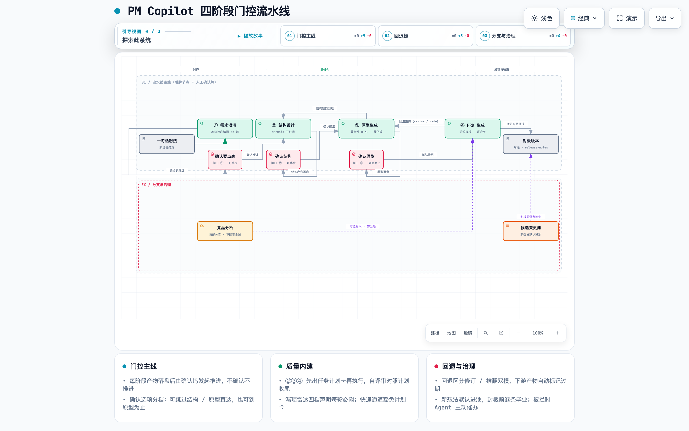
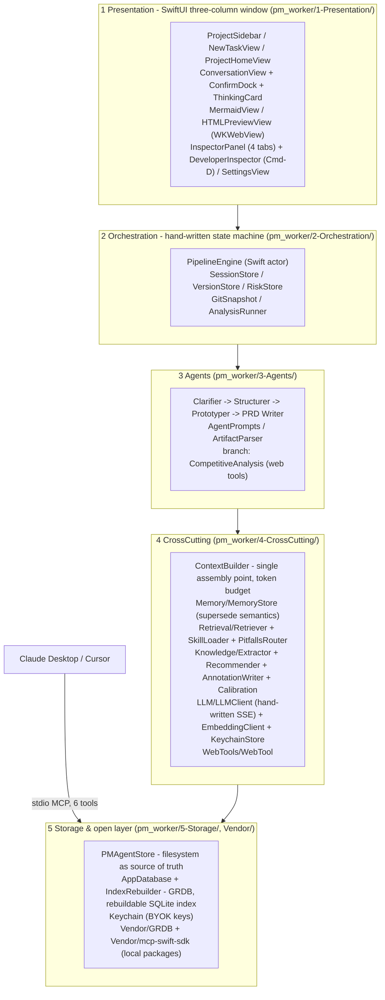
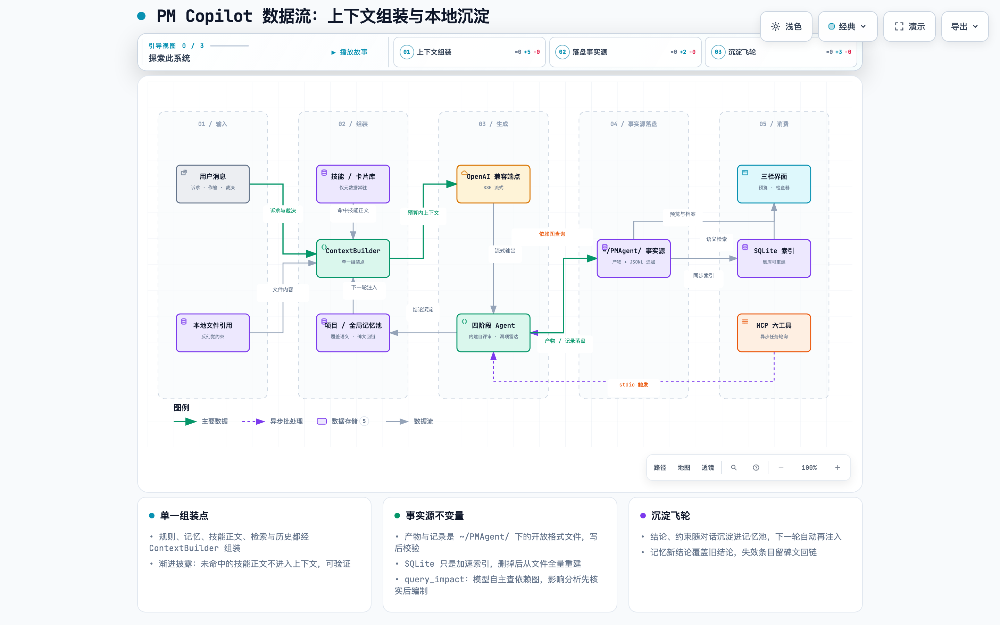

# PM Copilot (pm_worker)

> **Local-first full-process AI PM agent for macOS — clarify → structure → prototype → PRD, with human confirmation gates. BYOK, zero account, zero telemetry.**

<!-- Badges — placeholders, do not fabricate.
Uncomment and fill in once the corresponding services actually exist:

[](LICENSE)
[](#getting-started)
[](<add-workflow-url>)
[](<repo-url>)
-->

[English](README.md) · [简体中文](README.zh-CN.md)

## 30-second overview

<!-- GIF to be recorded — see docs/demo-script.md for the 30s storyboard. -->
<p align="center">
  
</p>
<p align="center"><em>One run of the gated pipeline: Socratic clarification → Mermaid structure rendered offline → clickable single-file prototype → tiered PRD with a transparent scoring card, gap radar and risk register, then the same pipeline called from Claude Desktop over MCP.</em></p>

You type one fuzzy sentence — *"an app for gym check-ins"*. PM Copilot runs a four-stage pipeline:

1. **Clarify** — a Socratic agent asks up to 5 one-question-at-a-time rounds (with tappable candidate options), and produces a five-field clarification table.
2. **Structure** — architecture diagram, core flow, and a module-page map as plain Mermaid in `.md` files. **You must confirm the structure before any prototype is generated.**
3. **Prototype** — a single-file HTML wireframe (zero external dependencies, renders offline) whose pages map 1:1 to the module-page map. **You must confirm the prototype before the PRD.**
4. **PRD** — written against the *confirmed* structure + prototype as a dual baseline, with a tiered template (lean / standard / full) chosen by a transparent, switchable scoring card.

Every agent output ends with a **gap radar** (✅ covered / ❓ possibly missing / ⏭️ deliberately skipped / 💀 fatal assumption). Fatal assumptions land in a **risk register** with observable trigger signals, settled by the pipeline state machine — not by the model polling itself. Conclusions, constraints, rejections, decisions and methodology notes are **automatically captured** as you talk, scoped per project/version, and re-injected in later stages. Everything lives in **real folders of Markdown / JSONL** on your disk; SQLite is only a rebuildable index.

<p align="center">
  
</p>
<p align="center"><em>The gated pipeline: three human confirmation docks (no advance without confirmation), fast-track options, revise/redo rework, and change governance. <a href="diagrams/pm-copilot-pipeline-workflow.html">Interactive version</a> (themes / guided views / export).</em></p>

## Why

- **The filesystem is the source of truth, not a database black box.** Projects, versions, decisions (`decisions.jsonl`), risks (`risks.jsonl`) and prototypes are open-format files in a visible directory tree. Edit them in Finder — that's a legal operation, and the index rebuilds from files.
- **You set the goal; it does the work.** It is an agent: it plans, decomposes tasks, calls the right skills and tools, and self-corrects on feedback. You weigh in at two kinds of moments only — defining the goal, and calibrating direction at irreversible checkpoints (the clarification table, the structure, and the prototype each gate the next stage). Everything between those checkpoints — planning, task breakdown, tool calls, corrections — runs on its own. The PRD may only describe the structure and prototype you confirmed — no invented features.
- **Self-review is built into every round, and it is honest about what it can't know.** The four-tier radar states what was covered, what still needs input, what was deliberately skipped, and which single assumption would sink the whole output. 💀 can legitimately be empty — filling it for the sake of it is forbidden by design.
- **Explainable context with progressive disclosure and scope isolation.** Only metadata of the 14 bundled methodology skills (KANO, RICE, JTBD …) is resident; a skill's body loads only when matched. Scope filtering (version > project > global) happens in the retrieval layer, not in a prompt. The ⌘D developer inspector shows the *unmatched* skill list and cross-project filter counts — "what didn't happen" is provable on screen.
- **Open via MCP.** The same pipeline can be driven from Claude Desktop or Cursor over a local stdio server (6 tools, async tasks).

## Architecture

Five layers, all running in one native Mac process — no server, no account, no cold start:



Layer notes (all paths relative to the repo root):

- **Context Builder is the single assembly point** (`pm_worker/4-CrossCutting/Context/ContextBuilder.swift`): rules, memory, matched skill bodies, retrieval results and history all pass through it under a token budget. Nothing is injected behind its back.
- **Deterministic routing sits next to RAG, not instead of it.** PRD templates (`pm_worker/Resources/templates/prd/{lean,standard,full}.md`) and skill `pitfalls` front-matter (`PitfallsRouter.swift`) are routed by fixed rules — an expired template is more dangerous than a missing one; knowledge cards go through in-memory cosine retrieval with scope filtering.
- **Mermaid and prototypes render offline**: `mermaid.min.js` is vendored in `pm_worker/Resources/vendor/`, prototypes are single-file HTML loaded into WKWebView.

<p align="center">
  
</p>
<p align="center"><em>Data flow: every injection passes the Context Builder; artifacts land with write-then-verify and the index rebuilds from files; conclusions and constraints sediment into memory and are re-injected next round. <a href="diagrams/pm-copilot-dataflow.html">Interactive version</a>.</em></p>

## Features

**The gated pipeline**
- Socratic clarification: ≤ 5 rounds, one question per round, tappable 2–4 candidate options plus free input; exhausted rounds force-bundle missing fields into open questions instead of stalling.
- Structure stage: architecture diagram, core flow, business flow (complex products only), module-page map — Mermaid source in `.md`, editable three ways (chat, in-app source view, Finder).
- Confirmation dock (`ConfirmDock`): a two-step docked card over the input field — confirm-and-advance / keep-editing / later; free-typed "let's move to the next stage" counts as confirm. No advancement without confirmation.
- Stale propagation: rework the structure → the prototype is marked stale (impact scoped local/all) → the PRD follows.

**Quality loops (built into every agent round)**
- Gap radar four-tier statement with an explicit accounting basis (stage checklist × upstream confirmed artifacts).
- Decision log (`decisions.jsonl`, append-only, five fields: decision / why / rejected alternatives / confidence / to-be-verified); key-decision criteria are observable (cross-stage impact / irreversibility / a real alternative existed).
- Risk register (`risks.jsonl`): every 💀 must carry a state-machine trigger signal (`structure_regen` / `prototype_regen` / `prd_stale` / `decision_overturned` / `release`); the state machine settles hits and writes back a predicted-vs-actual entry; soft cap of 3 active risks with convergence actions; sealing settles all open risks.

**Knowledge & memory (read-write bidirectional RAG)**
- Memory with **supersede semantics**: a new conclusion overwrites the old one (old entry marked, back-linked) — stale memory is more dangerous than no memory.
- Dual library: methodology cards ("how to do things", never expire, field notes append-only) vs. memory ("what happened", expires, overwritten). 14 skills preloaded; progressive disclosure keeps unmatched bodies out of the context (sentinel-tested).
- "Note this down" capture with semantic routing (methodology card vs. experience memory); card usage appends dated field notes; methodology recommendations at stage start (with reasons, rejectable, no re-pitching in the same stage); memory-calibrated injection of your past usage tendencies.

**Versions**
- planning → in-progress → released (sealed): manual seal, auto release-notes, read-only directory, git snapshot, side-by-side version compare; old versions stay byte-identical.

**Branches (off the main line, never blocking it)**
- Competitive analysis: manual run from the skill library or auto-triggered by chat intent ("help me research competitors"); web search/fetch with SSRF guards; every fact carries a source URL, "not found" is stated, never fabricated.
- Independent devil's-advocate review as an on-demand second opinion.

**Transparency**
- Right panel: Artifacts / Decision log / Gap radar / Knowledge tabs; ThinkingCard per reply ("thought Ns · M steps · skills ×K").
- ⌘D developer inspector: token composition, retrieval trace with scope tags, **unmatched skill list**, branch trigger records, recommendation & calibration traces, risk register internals.

**Tests** — 72 unit tests (`pm_workerTests/`) covering storage round-trips, pipeline gates & invalidation, risk settlement, retrieval scope isolation, context assembly and knowledge extraction. E2E runs with a real API key are part of the M5 milestone.

## Getting started

### Prerequisites

- macOS 26.0+ on Apple Silicon
- Xcode 26 (with its bundled toolchain)
- **No network needed to build** — `GRDB` and `mcp-swift-sdk` are vendored as local SPM packages under `Vendor/`, and Mermaid is bundled in `Resources/vendor/`. The only network the app ever uses is your chosen LLM endpoint (and the optional research branch).

### Build from source

```bash
git clone <repo>            # TODO: fill in the repository URL
cd pm_worker                # repo root — this is where pm_worker.xcodeproj lives
xcodebuild -project pm_worker.xcodeproj -scheme pm_worker -configuration Debug build
```

Or open `pm_worker.xcodeproj` in Xcode, pick the `pm_worker` scheme, and press ⌘R.

Run the unit tests (no API key required):

```bash
xcodebuild -project pm_worker.xcodeproj -scheme pm_worker test
```

### BYOK model configuration

PM Copilot ships with no model and sends no telemetry. Open **Settings (⌘,)** and configure per stage:

| Slot | Stage |
|---|---|
| `classify` | intent classification / routing (cheap model recommended) |
| `clarify` / `structure` / `prototype` / `prd` | the four main-line stages |
| `research` / `analysis` | the competitive-analysis branch |
| `review` | the devil's-advocate branch |
| `embedding` | vector encoding for the card/skill index |

Any OpenAI-compatible endpoint works — presets included for DeepSeek, Zhipu, OpenAI, Anthropic-compatible gateways and Ollama (`http://localhost:11434/v1` for fully local). **API keys are stored in the macOS Keychain** (never written to disk plaintext, never in Git). A per-run token budget can be set in Settings, along with the data directory and a one-click index rebuild.

Your data lands under `~/PMAgent/` — plain folders you can open in Finder, back up, or put under your own Git.

### MCP: call PM Copilot from Claude Desktop

> **Status:** the stdio MCP server is the final M5 milestone task — this section documents the shipped tool surface (design.md §7.1). Claude Desktop discovery was de-risked early with the echo spike in `Tools/MCPEchoSpike/`.

Launch the app binary as a local stdio server. In Claude Desktop's config (`claude_desktop_config.json`):

```json
{
  "mcpServers": {
    "pm-copilot": {
      "command": "/Applications/pm_worker.app/Contents/MacOS/pm_worker",
      "args": ["--mcp-server"]
    }
  }
}
```

(The app's MCP status page provides a one-click "Copy Claude Desktop config" button.)

| Tool | Input | Output | Notes |
|---|---|---|---|
| `analyze_requirement` | `idea: string` | clarification object | standalone clarification |
| `generate_structure` | `project, version` | `task_id` → poll `get_task` | async; requires the version's clarification; the structure still needs the user confirmation gate before `generate_prototype` can use it |
| `generate_prototype` | `project, version` | `task_id` → poll `get_task` | async; requires a **confirmed** structure (`02-structure/confirmed.json`), else it errors and guides you back |
| `generate_prd` | `project, version` | `task_id` → poll `get_task` | async; requires a **confirmed** prototype (`03-prototypes/confirmed.json`), else it errors and guides you back |
| `review_doc` | `doc: string` | review object | independent devil's-advocate review of any document |
| `get_task` | `task_id` | status / result | poll async tasks; tasks interrupted by an app restart are marked failed for the caller to retry |

Defaults: omit `project` → the `默认` project; omit `version` → that project's `unversioned/` folder — MCP calls never fail from missing parameters. MCP-triggered runs share the same pipeline state as the UI (you can watch them in the app).

## Design decisions

| Decision | Why | Where |
|---|---|---|
| Files are the source of truth; SQLite is a rebuildable index | Delete `index.sqlite`, rebuild from files — "your data is in a folder you can open" is a trust feature a SaaS can't copy | `5-Storage/PMAgentStore.swift`, `IndexRebuilder.swift` |
| Hand-written state machine (Swift actor), no orchestration framework | The gates, stale propagation and risk settlement *are* the product; outsourcing them to a framework outsources the learning | `2-Orchestration/PipelineEngine.swift` |
| Hand-written SSE streaming (`URLSession.bytes`) | One hand-rolled streaming + tool-calling loop is worth more than a dependency; fallback (MacPaw/OpenAI) was time-boxed, never needed | `4-CrossCutting/LLM/LLMClient.swift` |
| In-memory brute-force cosine now; SQLiteVec only past ~2000 chunks | Hundreds of chunks don't need a vector DB — the threshold and swap interface are written down, not improvised | `4-CrossCutting/Retrieval/Retriever.swift` |
| Confirmation gates in the state machine, not in prompts | "Please only consider the current stage" is a request; `confirmed.json` is an invariant | `2-Orchestration/`, `ConfirmDock.swift` |
| Supersede semantics for memory; append-only field notes for methodology | Stale conclusions must not coexist with new ones; methodology notes are compounding assets — official definitions are everywhere, field notes are yours | `4-CrossCutting/Memory/MemoryStore.swift`, `Knowledge/AnnotationWriter.swift` |
| Deterministic routing for templates and skill `pitfalls`; RAG only for knowledge | An expired template recalled by similarity is worse than no template; radar signals must not depend on semantic luck | `4-CrossCutting/Retrieval/PitfallsRouter.swift`, `Resources/templates/` |
| stdio MCP with async tasks | stdio is the native shape for a local app; long jobs return a `task_id` to poll | `Vendor/mcp-swift-sdk` |

## Project structure

```text
pm_worker.xcodeproj
Vendor/                      # vendored local SPM packages (offline builds)
  GRDB/                      # SQLite toolkit
  mcp-swift-sdk/             # official MCP Swift SDK
Tools/
  MCPEchoSpike/              # stdio echo spike — Claude Desktop discovery, de-risked early
pm_worker/
  pm_workerApp.swift
  1-Presentation/            # SwiftUI three-column UI (sidebar, workspace, inspector, settings)
  2-Orchestration/           # hand-written state machine, session/version/risk stores, git snapshots
  3-Agents/                  # agent prompts, artifact parser, competitive-analysis branch
  4-CrossCutting/            # Context Builder, memory, retrieval, knowledge, LLM clients, web tools
  5-Storage/                 # GRDB database, filesystem store, index rebuilder, Codable models
  Resources/
    skills/                  # 14 bundled methodology skills (KANO, RICE, JTBD, Five Whys, …)
    cards/                   # methodology cards with field notes
    rules/global.md          # global rule layer
    templates/prd/           # lean / standard / full PRD template set + review rubric
    vendor/mermaid.min.js    # offline Mermaid rendering
pm_workerTests/              # 72 unit tests
docs/
  demo-script.md             # 5-minute demo script + 3-min screen recording & 30s GIF storyboards
```

## Roadmap & status

| Milestone | Scope | Status |
|---|---|---|
| M0–M1 | project skeleton, Keychain/BYOK settings, SSE streaming, WKWebView preview, project/version folders | done |
| M2 | clarify / structure / prototype agents, confirmation dock, thinking card, state machine persistence | done |
| M3 | PRD agent (tiered templates + scoring card), self-review + gap radar + risk loop, decision log, sealing, competitive branch | done |
| M4 | dual library, retrieval scope isolation, capture & routing, recommendations & calibration, 4-tab inspector, ⌘D inspector | done — 72/72 unit tests green |
| M5 | MCP server (6 tools) + status page, bilingual README, demo materials, full E2E regression & north-star runs | **in progress** (this README is an M5 deliverable) |

V2 (architecture already reserved, per design.md §14): data-analysis branch (local CSV + Python), iteration management on top of version containers, retrospective stage writing back into the decision log, Feishu/Notion export, skill "learn" mode.

## License

MIT — the `LICENSE` file lands with the M5 release.

---

PM Copilot is a documentation-driven build: [PRD.md](PRD.md) (product requirements, 41 acceptance criteria), [design.md](design.md) (architecture, 39 eval items, decision records) and [skills-inventory.md](skills-inventory.md) (the bundled skill catalog) are all in this repo. 中文文档见 [README.zh-CN.md](README.zh-CN.md)。
