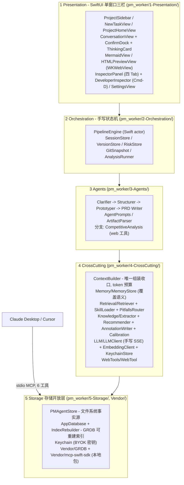

# PM Copilot（pm_worker）

> **本地优先的 macOS 原生 AI 产品经理全流程 Agent——澄清 → 结构 → 原型 → PRD 四阶段流水线，人在环确认闸口。自带模型 Key（BYOK），无账号、无遥测。**

[English](README.md) · [简体中文](README.zh-CN.md)

## 30 秒速览

<!-- GIF 待录制——30 秒分镜见 docs/demo-script.md。 -->
<p align="center">
  
</p>
<p align="center"><em>闸口式流水线一次完整运行：苏格拉底澄清 → Mermaid 结构图断网渲染 → 可点击单文件原型 → 三档 PRD（透明评分卡）+ 漏项雷达与风险登记册，最后在 Claude Desktop 里经 MCP 调用同一条流水线。</em></p>

输入一句模糊念头——「想做个健身打卡 App」，PM Copilot 跑四阶段流水线：

1. **澄清**：苏格拉底式追问（≤5 轮，每轮一问，候选选项可点选），产出五字段澄清要点表。
2. **结构**：功能架构图、核心流程图、模块-页面映射表（Mermaid 源码写入 `.md`）。**结构经你确认后才生成原型。**
3. **原型**：单文件 HTML 线框（零外部依赖、断网可渲染），页面与映射表一一对应。**原型经你确认后才写 PRD。**
4. **PRD**：以已确认的「结构 + 原型」为双重基准；分级模板（精简 / 标准 / 完整）由透明可切换的评分卡选档。

每个 Agent 输出末尾附**漏项雷达四档声明**（✅ 已覆盖 / ❓ 可能遗漏 / ⏭️ 刻意不展开 / 💀 致命漏洞假设）；💀 进入**风险登记册**，必带可观测触发信号、由状态机结算。对话中的结论、约束、否决项、决策与方法论心得**自动沉淀**（按项目/版本作用域隔离，后续阶段自动注入）。所有数据都是磁盘上真实文件夹里的 Markdown / JSONL；SQLite 只是可重建的索引。

## 为什么做它

- **文件系统是事实源，不是数据库黑盒**。项目、版本、决策日志（`decisions.jsonl`）、风险登记册（`risks.jsonl`）、原型都是可见目录树里的开放格式文件；Finder 手改是合法行为，索引随时可从文件重建。
- **目标由你定，执行交给它**。它是一个智能体：自主规划、拆解任务、按需调用技能与工具、按反馈自我修正。你只在两处发声——定义目的，以及在不可逆节点校准方向（澄清要点 / 结构 / 原型定稿前各一次，不确认不推进）；其余执行（怎么拆、调什么工具、发现偏差怎么修正）它自己完成。PRD 只能描述你确认过的结构与原型——无凭空功能。
- **自评审内建在每一轮，且诚实面对「不知道什么」**。四档雷达声明覆盖了什么、等什么输入、刻意跳过什么、哪个假设一旦不成立全盘崩塌；💀 可为空是明文合法——禁止为填而填。
- **上下文透明可解释 + 渐进披露 + 作用域隔离**。预置 14 个方法论技能（KANO / RICE / JTBD…）仅元数据常驻，命中才加载正文；scope 过滤写在检索层而非 prompt；⌘D 开发者检查器能看到「未命中 skill 列表」与跨项目过滤计数——「没发生什么」当场可证。
- **经 MCP 开放**。同一条流水线可被 Claude Desktop / Cursor 通过本地 stdio server 调用（6 工具、异步任务）。

## 架构

五层，全部跑在一个原生 Mac 进程里——无服务端、无账号、无冷启动：



要点（路径相对仓库根）：

- **Context Builder 是唯一收口**（`pm_worker/4-CrossCutting/Context/ContextBuilder.swift`）：规则、记忆、命中技能正文、检索结果、历史全部经它组装并受 token 预算约束。
- **规范路由与 RAG 并列**：PRD 模板（`pm_worker/Resources/templates/prd/{lean,standard,full}.md`）与技能 `pitfalls`（`PitfallsRouter.swift`）走确定性路由——过期规范比没有规范更危险；知识卡走向量检索 + scope 过滤。
- **断网可渲染**：`mermaid.min.js` 本地打包于 `pm_worker/Resources/vendor/`，原型为单文件 HTML 装入 WKWebView。

## 功能

- **闸口式流水线**：澄清（≤5 轮、选项式提问、耗尽强制收束）；结构三产物（Mermaid 源码、三层修改入口）；确认坞（两段式提交，自由作答「进入下一个阶段」等价确认）；过期传播分级标记（结构改→原型过期→PRD 过期）。
- **质量闭环**：漏项雷达四档（判断依据=阶段清单×上游产物对账）；决策日志五要素 append-only；风险登记册（必带触发信号、状态机结算、软上限 3 条、封板终态、命中回写「预测 vs 实际」）。
- **知识与记忆（读写双向 RAG）**：记忆覆盖语义（新结论覆盖旧结论）；同层双库（方法论卡「怎么做事」注记只增不覆盖 vs 记忆「发生过什么」会过时被覆盖）；「这条记下来」归属分流；阶段开始方法论主动推荐（含理由、可拒绝）；记忆校准注入。
- **版本**：规划中 → 进行中 → 已封板（手动封板、自动 release-notes、目录只读、Git 快照、并排对比、旧版逐字一致）。
- **分支（不阻塞主线）**：竞品分析（手动运行 / 对话意图自动命中，事实必带出处、查不到标「未找到」）；独立毒舌评审第二意见。
- **透明化**：右栏四 Tab（产物 / 决策日志 / 漏项雷达 / 知识点）；每轮回复带思考卡；⌘D 开发者检查器（token 构成 / 检索 trace / **未命中 skill 列表** / 分支触发 / 推荐与校准 trace / 风险工程口径）。
- **测试**：72 条单测（`pm_workerTests/`）覆盖存储 round-trip、流水线闸口与过期、风险结算、检索 scope 隔离、上下文组装与知识抽取；真实 API Key 的 E2E 属 M5 里程碑。

## 快速开始

### 前置

- macOS 26.0+（Apple Silicon）
- Xcode 26
- **构建无需联网**——`GRDB` 与 `mcp-swift-sdk` 均为 `Vendor/` 下本地 SPM 包，Mermaid 打包于 `Resources/vendor/`；App 运行只在你配置的 LLM 端点（与可选调研分支）上联网。

### 从源码构建

```bash
git clone <repo>            # TODO: 待填仓库地址
cd pm_worker                # 仓库根——pm_worker.xcodeproj 在这里
xcodebuild -project pm_worker.xcodeproj -scheme pm_worker -configuration Debug build
```

或用 Xcode 打开 `pm_worker.xcodeproj`，选 `pm_worker` scheme，⌘R 运行。

跑单测（无需 API Key）：

```bash
xcodebuild -project pm_worker.xcodeproj -scheme pm_worker test
```

### BYOK 模型配置

产品不带模型、不发包。打开 **设置（⌘,）** 按阶段配置：`classify`（意图分类，建议便宜模型）/ `clarify` / `structure` / `prototype` / `prd`（主线四阶段）/ `research`·`analysis`（调研分支）/ `review`（毒舌评审）/ `embedding`（向量编码）。

任意 OpenAI 兼容端点可用——预置 DeepSeek、智谱、OpenAI、Anthropic 兼容网关与 Ollama（`http://localhost:11434/v1`，可全本地）。**API Key 存 macOS Keychain**（不落明文、不入 Git）。设置里另有单次运行 token 上限、数据目录位置与一键重建索引。

数据落在 `~/PMAgent/`——Finder 可打开、可备份、可自己 `git init`。

### MCP：从 Claude Desktop 调用 PM Copilot

> **状态**：stdio MCP server 是 M5 收尾任务——本节为发布工具面（design.md §7.1）；Claude Desktop 发现已用 `Tools/MCPEchoSpike/` 前置踩坑验证。

将 App 可执行文件作为本地 stdio server 启动。Claude Desktop 配置（`claude_desktop_config.json`）：

```json
{
  "mcpServers": {
    "pm-copilot": {
      "command": "/Applications/pm_worker.app/Contents/MacOS/pm_worker",
      "args": ["--mcp-server"]
    }
  }
}
```

（App 的 MCP 状态页提供一键「复制 Claude Desktop 配置」。）

| 工具 | 入参 | 出参 | 说明 |
|---|---|---|---|
| `analyze_requirement` | `idea: string` | 澄清对象 | 单独调用澄清能力 |
| `generate_structure` | `project, version` | `task_id` → 轮询 `get_task` | 异步；需该版本已有澄清；结构仍需过用户确认闸口才可被 `generate_prototype` 引用 |
| `generate_prototype` | `project, version` | `task_id` → 轮询 `get_task` | 异步；需**已确认结构**（`02-structure/confirmed.json`），否则报错引导 |
| `generate_prd` | `project, version` | `task_id` → 轮询 `get_task` | 异步；需**已确认原型**（`03-prototypes/confirmed.json`），否则报错引导 |
| `review_doc` | `doc: string` | 评审对象 | 对任意文档的独立毒舌评审 |
| `get_task` | `task_id` | status / result | 异步任务轮询；App 重启后 running 任务标 failed 由调用方重试 |

缺省兜底：不传 `project` → 落「默认」项目；不传 `version` → 落该项目 `unversioned/`——MCP 调用永不因缺参报错丢数据。MCP 触发的运行与 UI 共享同一条流水线状态。

## 设计决策

| 决策 | 为什么 | 落点 |
|---|---|---|
| 文件是事实源，SQLite 只是可重建索引 | 删掉 `index.sqlite` 从文件重建——「你的数据在你能打开的文件夹里」是 SaaS 说不出的信任特性 | `5-Storage/PMAgentStore.swift`、`IndexRebuilder.swift` |
| 手写状态机（Swift actor），不用编排框架 | 闸口、过期传播、风险结算就是产品本身——外包给框架等于外包掉要学的东西 | `2-Orchestration/PipelineEngine.swift` |
| 手写 SSE 流式（`URLSession.bytes`） | 手写一次流式 + 工具调用回路比一个依赖更值；兜底方案设了时限但从未启用 | `4-CrossCutting/LLM/LLMClient.swift` |
| 内存暴力余弦起步，~2000 chunk 才换 SQLiteVec | 几百条 chunk 不需要向量库——阈值与切换接口写死在先，不是临场发挥 | `4-CrossCutting/Retrieval/Retriever.swift` |
| 确认闸口写在状态机，不写在 prompt | 「请只考虑当前阶段」是请求；`confirmed.json` 是不变量 | `2-Orchestration/`、`ConfirmDock.swift` |
| 记忆覆盖语义；方法论注记只增不覆盖 | 过期结论不得与新结论并存；注记是复利资产——官方定义谁都有，注记才是你的 | `Memory/MemoryStore.swift`、`Knowledge/AnnotationWriter.swift` |
| 模板与技能 pitfalls 走确定性路由，RAG 只管知识 | 相似度召回一个过期模板比没有模板更糟；雷达信号不能押在语义运气上 | `Retrieval/PitfallsRouter.swift`、`Resources/templates/` |
| stdio MCP + 异步任务 | stdio 是本地 App 的原生形态；长任务返回 `task_id` 轮询 | `Vendor/mcp-swift-sdk` |

## 目录结构

```text
pm_worker.xcodeproj
Vendor/                      # 本地 SPM 包（离线构建）
  GRDB/                      # SQLite 工具库
  mcp-swift-sdk/             # MCP 官方 Swift SDK
Tools/
  MCPEchoSpike/              # stdio echo 踩坑——前置验证 Claude Desktop 发现
pm_worker/
  pm_workerApp.swift
  1-Presentation/            # SwiftUI 三栏界面（导航 / 工作区 / 检查器 / 设置）
  2-Orchestration/           # 手写状态机、会话/版本/风险存储、Git 快照
  3-Agents/                  # Agent prompt、产物解析、竞品分析分支
  4-CrossCutting/            # Context Builder、记忆、检索、知识、LLM 客户端、web 工具
  5-Storage/                 # GRDB 数据库、文件存储、索引重建、Codable 模型
  Resources/
    skills/                  # 预置 14 个方法论技能（KANO / RICE / JTBD / 五问…）
    cards/                   # 方法论卡（含实战注记）
    rules/global.md          # 全局规则层
    templates/prd/           # 精简 / 标准 / 完整 PRD 模板集 + 评审 rubric
    vendor/mermaid.min.js    # 离线 Mermaid 渲染
pm_workerTests/              # 72 条单测
docs/
  demo-script.md             # 5 分钟演示脚本 + 3 分钟录屏与 30 秒 GIF 分镜
```

## 路线图与状态

| 里程碑 | 范围 | 状态 |
|---|---|---|
| M0–M1 | 工程骨架、Keychain/BYOK 设置、SSE 流式、WKWebView 预览、项目/版本文件夹 | 完成 |
| M2 | 澄清/结构/原型 Agent、确认坞、思考卡、状态机持久化 | 完成 |
| M3 | PRD Agent（分级模板+评分卡）、自评审+漏项雷达+风险闭环、决策日志、封板、竞品分支 | 完成 |
| M4 | 同层双库、检索 scope 隔离、沉淀与分流、推荐与校准、右栏四 Tab、⌘D 检查器 | 完成——72/72 单测全绿 |
| M5 | MCP server（6 工具）+ 状态页、双语 README、演示物料、全量 E2E 回归与北极星验收 | **进行中**（本 README 即 M5 交付物） |

V2（架构已预留，见 design.md §14）：数据分析分支（本地 CSV + Python）、基于版本容器的迭代管理、复盘阶段回写决策日志、飞书/Notion 导出、技能「学」模式。

## 许可证

MIT——`LICENSE` 文件随 M5 发布落盘。

---

本项目文档驱动开发：[PRD.md](PRD.md)（产品需求，41 条验收标准）、[design.md](design.md)（架构与 39 条 Eval、决策记录）、[skills-inventory.md](skills-inventory.md)（技能清单）都在仓库内。English README: [README.md](README.md)。
